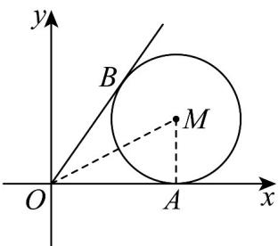

> [!faq]- 《高二数学上学期第一次月考_人教A版2019选择性必修第一册第一章_第二》官方解析
>
> > [!success]- **【答案】** $\frac{4}{3}$ [2,4]
>
> > [!note]- **【解析】**
> > 方法一 $x^{2} + y^{2} - 4x - 2y + 4 = 0$ 可化为 $(x - 2)^{2} + (y - 1)^{2} = 1$ ，此方程表示圆心为(2,1)，半径为1的
> >
> > 圆.
> >
> > 设 $\frac{y}{x} = k$ ，则直线 $y = kx$ 与圆有公共点（将所求问题转化为直线与圆有公共点进行求解是解题的关键），所以 $\frac{|2k - 1|}{\sqrt{k^2 + 1}} \leq 1$ ，解得 $0 \leq k \leq \frac{4}{3}$ ，所以 $\frac{y}{x}$ 的最大值为 $\frac{4}{3}$ 。
> >
> > $\frac{|3x + 4y + 5|}{5}$ 表示圆上的点 $(x,y)$ 到直线 $3x + 4y + 5 = 0$ 的距离，
> >
> > 因为圆心(2,1)到直线 $3x + 4y + 5 = 0$ 的距离为 $\frac{|3\times 2 + 4\times 1 + 5|}{\sqrt{3^2 + 4^2}} = \frac{15}{5} = 3$
> >
> > 所以 $3 - 1 \leq \frac{|3x + 4y + 5|}{5} \leq 3 + 1$ ，即 $2 \leq \frac{|3x + 4y + 5|}{5} \leq 4$
> >
> > 方法二 $x^{2} + y^{2} - 4x - 2y + 4 = 0$ 可化为 $(x - 2)^{2} + (y - 1)^{2} = 1$ ，此方程表示圆心为(2,1)，半径为1的圆，
> >
> > 所以 $\frac{y}{x} = \frac{y - 0}{x - 0}$ 可以看作是圆 $M:(x - 2)^2 +(y - 1)^2 = 1$ 上一点 $(x,y)$ 与原点连线的斜率，
> >
> > 如图所示，OA，OB与圆M分别相切于A，B，所以 $|OB|=|OA|=2$ ，连接MA，OM，
> >
> > 所以 $\tan \angle MOA = \frac{|MA|}{|OA|} = \frac{1}{2}$ ，所以 $\tan \angle BOA = \tan 2\angle MOA = \frac{2\tan\angle MOA}{1 - \tan^2\angle MOA} = \frac{1}{1 - \frac{1}{4}} = \frac{4}{3}$
> >
> > 所以圆 $M$ 上一点与原点连线的斜率的最大值为 $k_{OB} = \frac{4}{3}$ .设 $x = 2 + \cos \theta ,y = 1 + \sin \theta$
> >
> > 所以 $\frac{|3x + 4y + 5|}{5} = \frac{|3(2 + \cos\theta) + 4(1 + \sin\theta) + 5|}{5} =$
> >
> > $$
> > \frac {\left| 3 \cos \theta + 4 \sin \theta + 1 5 \right|}{5} = \left| \sin (\theta + \alpha) + 3 \right| \left(\sin \alpha = \frac {3}{5}, \cos \alpha = \frac {4}{5}\right) _ {\text {且}} \sin (\theta + \alpha) \in [ - 1, 1 ]
> > $$
> >
> > 所以 $\frac{|3x+4y+5|}{5} \neq \sin(\theta + \alpha) + \beta \in [2,4]$ .
> >
> > 
> >
> > 故答案为： $\frac{4}{3}$ ，[2,4]
