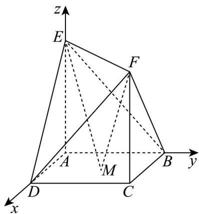

> [!faq]- 《高二数学上学期第一次月考_人教A版2019选择性必修第一册第一章_第二》官方解析
>
> > [!success]- **【答案】** $\frac{15}{2}$
>
> > [!note]- **【解析】**
> > 因为 $AE \perp$ 底面 ABCD，AD， $AB \subset$ 平面 ABCD，所以 $AE \perp AD$ ， $AE \perp AB$
> >
> > 因为四边形 ABCD 为正方形，所以 $AD \perp AB$ ，所以 AD，AB，AE 两两垂直，
> >
> > 以 $A$ 为坐标原点，以 $\overline{AD}$ ， $\overline{AB}$ ， $\overline{AE}$ 的方向分别为 $x, y, z$ 轴的正方向建立如图所示的空间直角坐标系，
> >
> > 
> >
> > 则 $E(0,0,2)$ ， $F(1,1,2)$ ，设 $M(a,b,0)(0 \leq a \leq 1,0 \leq b \leq 1)$ ，则 $ME = (-a, -b, 2)$ ， $MF = (1 - a, 1 - b, 2)$
> >
> > 所以 $\overline{ME} \cdot \overline{MF} = -a(1 - a) - b(1 - b) + 4 = a^{2} - a + b^{2} - b + 4 = \left(a - \frac{1}{2}\right)^{2} + \left(b - \frac{1}{2}\right)^{2} + \frac{7}{2}$
> >
> > 因为 $0 \leq a \leq 1$ ， $0 \leq b \leq 1$ ，所以当 $a = b = \frac{1}{2}$ 时， $\overline{ME} \cdot \overline{MF}$ 取得最小值 $\frac{7}{2}$ ；
> >
> > 当 $a = 0$ 或1， $b = 0$ 或1时， $\overline{ME} \cdot \overline{MF}$ 取得最大值4．则 $\overline{ME} \cdot \overline{MF}$ 的最小值与最大值的和为 $\frac{7}{2} + 4 = \frac{15}{2}$
> >
> > 故答案为： $\frac{15}{2}$
> >
> > 14. 以下四种表述正确的是\_\_\_\_(填写正确表述的序号)
> > - **①**：点 $(2a, a - 1)$ 在圆 $x^{2} + (y - 1)^{2} = 5$ 的内部，则 $a$ 的取值范围是 $\left(-\frac{1}{5}, 1\right)$
> > - **②**：圆 $x^{2} + y^{2} = 4$ 上有且仅有3个点到直线 $l: x - y + \sqrt{2} = 0$ 的距离都等于1
> > - **③**：曲线 $C_1: x^2 + y^2 + 2x = 0$ 与曲线 $C_2: x^2 + y^2 - 4x - 8y + m = 0$ 恰有三条公切线，则 $m = 4$
> > - **④**：直线 $(3 + m)x + 4y - 3 + 3m = 0(m\in \mathbb{R})$ 恒过定点 $(-3, - 3)$
> >
> > 【答案】①②③
> >
> > 【详解】对于①，因为点 $(2a,a-1)$ 在圆 $x^{2}+(y-1)^{2}=5$ 的内部，
> >
> > 所以 $(2a)^{2} + (a - 1 - 1)^{2} < 5$ ，解得： $-\frac{1}{5} < a < 1$ ，即 $a$ 的取值范围是 $\left(-\frac{1}{5}, 1\right)$ ，故①正确；
> > - **对于 ②**：，圆 $x^{2}+y^{2}=4$ 的圆心为 $(0,0)$ ，半径为R=2，
> >
> > 圆心 $(0,0)$ 到直线 $l: x - y + \sqrt{2} = 0$ 的距离 $d = \frac{\left|\sqrt{2}\right|}{\sqrt{1^{2} + (-1)^{2}}} = 1$
> >
> > 又因为 $R - d = 1$ ，所以圆 $x^{2} + y^{2} = 4$ 上有且仅有3个点到直线 $l: x - y + \sqrt{2} = 0$ 的距离都等于1，故②正确；
> > - **对于 ③**：，曲线 $C_1: x^2 + y^2 + 2x = 0$ 即 $(x + 1)^2 + y^2 = 1$
> >
> > 则圆心 $C_1(-10)$ ，半径为1，曲线 $C_2:x^2 +y^2 -4x - 8y + m = 0$ 即 $\left(x - 2\right)^2 +\left(y - 4\right)^2 = 20 - m$
> >
> > 则圆心 $C_2(24)$ ，半径为 $\sqrt{20 - m}$ ，两圆的圆心距为 $\sqrt{(2 + 1)^2 + 4^2} = 5$
> >
> > 因为圆 $C_1: (x + 1)^2 + y^2 = 1$ 与圆 $C_2: (x - 2)^2 + (y - 4)^2 = 20 - m$ 有三条公切线，
> >
> > 则两圆属于外切的位置关系，所以 $5 = 1 + \sqrt{20 - m}$ ，解得 $m = 4$ ，故③正确；
> > - **对于 ④**：，直线 $\left(3 + m\right)x + 4y - 3 + 3m = 0(m \in \mathbb{R})$ 即 $\left(x + 3\right)m + 3x + 4y - 3 = 0$
> >
> > 由 $\left\{ \begin{array}{l}x + 3 = 0\\ 3x + 4y - 3 = 0 \end{array} \right.$ ，解得 $\left\{ \begin{array}{l}x = -3\\ y = 3 \end{array} \right.$
> >
> > 所以直线过定点 $(-3,3)$ ，故④错误。
> >
> > 故答案为：①②③.
