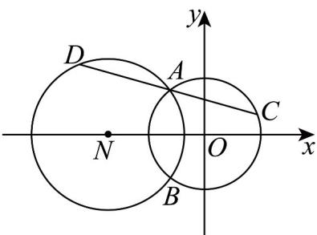

> [!faq]- 《高二数学上学期第一次月考_人教A版2019选择性必修第一册第一章_第二》官方解析
>
> > [!success]- **【答案】** (1) $\left(x+\frac{9}{5}\right)^{2}+y^{2}=\frac{144}{25}$ $7x + 24y - 45 = 0$ (2)
>
> > [!note]- **【解析】**
> > （1）根据题意，圆 $O: x^2 + y^2 = 9$ ，圆心为 $O(0,0)$ ，半径为3，
> >
> > 圆 $N:(x + 5)^2 +y^2 = 16$ ，圆心为 $N(-5,0)$ ，半径为4，两圆方程相减得 $x = -\frac{9}{5}$ ，所以直线 $AB$ 的方程为 $x = -\frac{9}{5}$
> >
> > 所以所求圆的圆心为 $\left(-\frac{9}{5},0\right)$ ，半径为 $\sqrt{9 - \left(\frac{9}{5}\right)^2} = \frac{12}{5}$
> >
> > 所以以 $AB$ 为直径的圆的方程为 $\left(x + \frac{9}{5}\right)^2 + y^2 = \frac{144}{25}$
> >
> > (2) $A$ 在第二象限，由（1）可得 $A\left(-\frac{9}{5}, \frac{12}{5}\right)$
> >
> > 如图，不妨设点 C, D 分别在圆 O 和圆 N 上，易知直线 CD 的斜率存在，设直线 CD 的方程是
> >
> > $y - \frac{12}{5} = k\left(x + \frac{9}{5}\right)$ ，即 $5kx - 5y + 9k + 12 = 0$ ，则点 $O$ 到直线 $CD$ 的距离为 $\frac{|9k + 12|}{\sqrt{25k^2 + 25}}$ ，点 $N$ 到直线 $CD$ 的距
> >
> > 离为 $\frac{|-25k + 9k + 12|}{\sqrt{25k^2 + 25}} = \frac{|-16k + 12|}{\sqrt{25k^2 + 25}}$
> >
> > 
> >
> > 因为 $|AC| = |AD|$ ，所以 $9 - \frac{(9k + 12)^2}{25k^2 + 25} = 16 - \frac{(-16k + 12)^2}{25k^2 + 25}$ ，解得 $k = -\frac{7}{24}$
> >
> > 所以直线 $CD$ 的方程为 $7x + 24y - 45 = 0$
