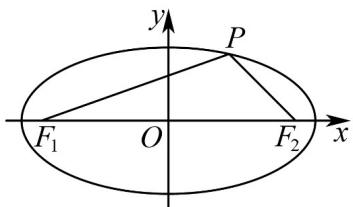

> [!faq]- 《高二数学上学期第三次月考_人教A版2019选择性必修第一册全部_选择性》官方解析
>
> > [!success]- **【答案】** BCD
>
> > [!note]- **【解析】**
> > A：由椭圆方程，若 C 的焦点在 y 轴上，则 0 < k < 4，故错误；
> >
> > B：当椭圆焦点在 $x$ 轴上时， $\sqrt{1 - \frac{4}{k}} = \frac{1}{2}$ ，可得 $k = \frac{16}{3}$
> >
> > 当椭圆焦点在 $y$ 轴上时， $\sqrt{1 - \frac{k}{4}} = \frac{1}{2}$ ，可得 $k = 3$ ，故正确；
> >
> > C、D：由题设 $C:\frac{x^2}{16} +\frac{y^2}{4} = 1$ ，则 $a = 4,b = 2,c = 2\sqrt{3}$
> >
> > 当 $\angle F_{1}PF_{2} = 60^{\circ}$ ，则 $\left|PF_1\right|^2 +\left|PF_2\right|^2 -2\left|PF_1\right||PF_2|\cos 60^\circ = \left|F_1F_2\right|^2$
> >
> > 所以 $(|PF_1| + |PF_2|)^2 - 3|PF_1||PF_2| = 48$ ，而 $|PF_1| + |PF_2| = 8$ ，则 $|PF_1||PF_2| = \frac{16}{3}$
> >
> > 所以 $S_{\triangle PF_{1}F_{2}}=\frac{1}{2}\left|PF_{1}\right|\left|PF_{2}\right|\sin60^{\circ}=\frac{1}{2}\times\frac{16}{3}\times\frac{\sqrt{3}}{2}=\frac{4\sqrt{3}}{3}$ ，C 正确，
> >
> > 当 $P$ 为椭圆上下顶点时， $|PF_1| = |PF_2| = 4$ ，则 $\cos \angle F_1PF_2 = \frac{|PF_1|^2 + |PF_2|^2 - |F_1F_2|^2}{2|PF_1||PF_2|} = \frac{16 + 16 - 48}{2 \times 4 \times 4} = -\frac{1}{2}$
> >
> > 此时，在 $\triangle F_{1}PF_{2}$ 中 $\angle F_{1}PF_{2} = 120^{\circ}$ ，故 $\angle F_{1}PF_{2}$ 最大角可达到 $120^{\circ}$ ，
> >
> > 所以存在点 P 使得 $\angle F_{1}PF_{2}=90^{\circ}$ ，D 正确.
> >
> > 
> >
> > 故选 **BCD**
