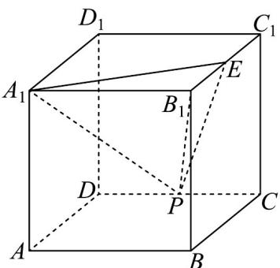

<!-- question-source:start -->
14．如图，在棱长为2的正方体 $ABCD - A_{1}B_{1}C_{1}D_{1}$ 中， $E$ 为棱 $B_{1}C_{1}$ 的中点，动点 $P$ 在直线 $DC$ 上移动，对于

下列四个结论：

①存在唯一点 P，使得 $PA_{1} = PE$ ；

②三棱锥 $A_{1}-PB_{1}E$ 的体积不变；

③平面 $PA_{1}E$ 截正方体 $ABCD-A_{1}B_{1}C_{1}D_{1}$ 所得截面形状是梯形或平行四边形；

④ $\triangle PA_{1}E$ 的面积最小值为 $\sqrt{6}$ ;

则所有正确结论的序号是\_\_\_\_.
<!-- question-source:end -->

![[高中/课堂同步/题库/人教A版高中数学同步讲义(2026)/03_选择性必修第一册/月考/阶段测试/高二数学上学期第三次月考_人教A版2019选择性必修第一册全部_选择性/三_填空题_sec_04/questions/answers/Q00062117A1.md]]
