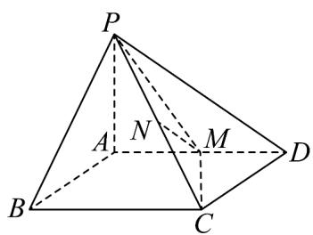

<!-- question-source:start -->
18．（17分）如图，已知四棱锥 $P - ABCD$ 的底面 $ABCD$ 是边长为2的菱形， $PA \perp$ 平面 $ABCD$ ， $M$ 是 $AD$

的中点， $N$ 是 $PC$ 的中点.

(1)求证： $MN / /$ 平面 $PAB$ ；

(2)若平面 $PMC \perp$ 平面 $PAD$ ，求证： $CM \perp AD$ ；

(3)在（2）的条件下，且平面 $PBC$ 与平面 $PCD$ 的夹角余弦值为 $\frac{5}{8}$ ，求四棱锥 $P-ABCD$ 的体积。
<!-- question-source:end -->

![[高中/课堂同步/题库/人教A版高中数学同步讲义(2026)/03_选择性必修第一册/月考/阶段测试/高二数学上学期第三次月考_人教A版2019选择性必修第一册全部_选择性/三_填空题_sec_04/questions/answers/Q00062121A1.md]]
