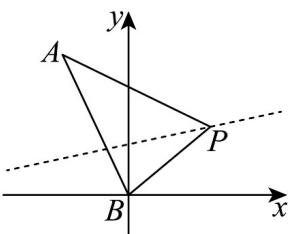

> [!faq]- 《高二数学上学期第三次月考_人教A版2019选择性必修第一册全部_高效培》官方解析
>
> > [!success]- **【答案】** D
>
> > [!note]- **【解析】**
> > 由直线 $l:(k + 1)x - (2k - 2)y + 2k - 6 = 0$
> >
> > 变形可得 $\left(x - 2y + 2\right)k + x + 2y - 6 = 0$
> >
> > 由 $\left\{ \begin{array}{l}x - 2y + 2 = 0\\ x + 2y - 6 = 0 \end{array} \right.$ ，解得 $\left\{ \begin{array}{l}x = 2\\ y = 2 \end{array} \right.$
> >
> > 可得直线 l 恒过定点 $P(2,2)$ ，则 $k_{PA} = \frac{5 - 2}{-1 - 2} = -1, k_{PB} = \frac{2 - 0}{2 - 0} = 1$ ，
> >
> > 结合图象可得：
> >
> > 
> >
> > 若直线 l 与线段 AB 有公共点，则直线 l 斜率的取值范围为 $\left[-1,1\right]$ ，
> >
> > 由斜率定义 $k = \tan \alpha$ ，可得直线 $l$ 倾斜角的取值范围为 $\left[0, \frac{\pi}{4}\right] \cup \left[\frac{3\pi}{4}, \pi\right)$ .
> >
> > 故选：D.
> >
> > 4．方程 $\frac{x^{2}}{k+3}+\frac{y^{2}}{2k+4}=1$ 表示焦点在 y 轴上的椭圆，则 k 的取值范围为（）
> > A. k > -3    B. k > -2    C. k > -1    D. k > 0
> >
> > 【答案】C
> >
> > 【详解】由方程 $\frac{x^2}{k + 3} +\frac{y^2}{2k + 4} = 1$ 表示焦点在 $y$ 轴上的椭圆，得 $2k + 4 > k + 3 > 0$ ，解得 $k > - 1$
> >
> > 所以 k 的取值范围为 k > -1.
> >
> > 故选 **C**
