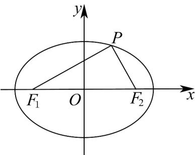

> [!faq]- 《高二数学上学期第三次月考_人教A版2019选择性必修第一册全部_高效培》官方解析
>
> > [!success]- **【答案】** A
>
> > [!note]- **【解析】**
> > 根据题意知， $F_{1}(-2,0)$ ， $F_{2}(2,0)$ ， $\left|PF_{1}\right|+\left|PF_{2}\right|=2a=6$ 。
> > 因为 $\triangle PF_{1}F_{2}$ 的内切圆半径为 $\frac{2}{3}$ ，
> > 所以 $S_{\triangle PF_{1}F_{2}}=\frac{1}{2}\left|PF_{1}\right|\times\frac{2}{3}+\frac{1}{2}\left|PF_{2}\right|\times\frac{2}{3}+\frac{1}{2}\left|F_{1}F_{2}\right|\times\frac{2}{3}=\frac{1}{3}\left(\left|PF_{1}\right|+\left|PF_{2}\right|\right)+\frac{4}{3}=\frac{10}{3}$ 设 $P(x_{P},y_{P})$ ，所以 $S_{\triangle PF_{1}F_{2}}=\frac{1}{2}\left|F_{1}F_{2}\right|\times y_{P}=2y_{P}$ 所以 $2y_{P}=\frac{10}{3}$ ，解得 $y_{P}=\frac{5}{3}$ .
> > 因为 $P(x_{P},y_{P})$ 在椭圆上，且在第一象限，所以满足 $\frac{x_{P}^{2}}{9}+\frac{y_{P}^{2}}{5}=1$ 解得 $x_{P}=2$ ，所以 $P\left(2,\frac{5}{3}\right)$ .
> > 所以 $\overline{PF}_{1}=\left(4,\frac{5}{3}\right),\overline{PF}_{2}=\left(0,\frac{5}{3}\right),\overline{PF}_{1}\cdot PF_{2}=0+\frac{5}{3}\times\frac{5}{3}=\frac{25}{9}$
> >
> > 故选：A.
> >
> > 
