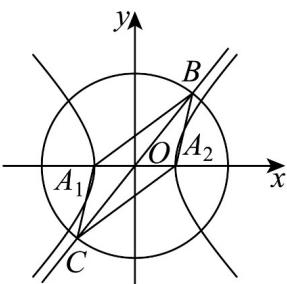

> [!faq]- 《高二数学上学期第三次月考_人教A版2019选择性必修第一册全部_高效培》官方解析
>
> > [!success]- **【答案】** AC
>
> > [!note]- **【解析】**
> > 对于 A，由双曲线的对称性，可得 B, C 关于原点 O 对称，且 $A_{1}, A_{2}$ 也关于原点 O 对称，
> >
> > 即四边形 $BA_{1}CA_{2}$ 的对角线互相平分，所以四边形 $BA_{1}CA_{2}$ 为平行四边形，
> >
> > 因为 $\angle A_{1}BA_{2}=45^{\circ}$ ，所以 $\angle BA_{2}C=135^{\circ}$ ，所以 A 正确；
> >
> > 对于B，不妨设双曲线 $\Gamma$ 的渐近线为 $y = \frac{b}{a} x$ 与圆 $O$ 交于 $B,C$ 两点，
> >
> > 联立方程组 $\left\{ \begin{array}{l} y = \frac{b}{a} x \\ x^2 + y^2 = a^2 + b^2 \end{array} \right.$ ，解得 $x = a, y = b$ 或 $x = -a, y = -b$ ，
> >
> > 不妨设 $B(a,b), C(-a,-b)$
> >
> > 因为 $A_{1}(-a,0), A_{2}(a,0)$ ，所以 $\overline{BA}_{1} = (-2a, -b), \overline{BA}_{2} = (0, -b)$
> >
> > 因为 $\angle A_{1}BA_{2}=45^{\circ}$ ，可得 $\cos\overrightarrow{BA_{1}},\overrightarrow{BA_{2}}=\frac{\overrightarrow{BA_{1}}\cdot\overrightarrow{BA_{2}}}{\left|\overrightarrow{BA_{1}}\right|\left|\overrightarrow{BA_{2}}\right|}=\frac{b^{2}}{\sqrt{4a^{2}+b^{2}}\times b}=\frac{\sqrt{2}}{2}$
> >
> > 可得 b = 2a ，所以双曲线 $\Gamma$ 的渐近线为 $y = \pm 2x$
> >
> > 因为 $y = 2x - 3$ 与 $y = 2x$ 平行，所以 $y = 2x - 3$ 与 $\Gamma$ 仅有一个公共点，所以 B 错误；
> >
> > 对于 C，由 b = 2a ，可得 $\overline{BA_{1}} = (-2a, -2a), \overline{BA_{2}} = (0, -2a)$
> >
> > 所以 $\left|\overline{BA_{1}}\right|=2\sqrt{2}a,\left|\overline{BA_{2}}\right|=2a$ ，所以 $\left|\overline{\frac{BA_{4}}{BA_{2}}}\right|=\sqrt{2}$ ，即 $\frac{\left|BA_{1}\right|}{\left|BA_{2}\right|}=\sqrt{2}$
> >
> > 当 $B,C$ 两点位置互换时，此时 $\frac{\left|\overline{BA}_1\right|}{\left|BA_2\right|} = \frac{\sqrt{2}}{2}$ ，即 $\frac{\left|BA_1\right|}{\left|BA_2\right|} = \frac{\sqrt{2}}{2}$
> >
> > 综上可得， $\frac{|BA_1|}{|BA_2|} = \sqrt{2}$ 或 $\frac{|BA_1|}{|BA_2|} = \frac{\sqrt{2}}{2}$ ，所以C正确；
> >
> > 对于 D，由向量 $A_{1}A_{2}=(2a,0),BA_{2}=(0,-b)$ ，所以 $A_{1}A_{2}\cdot BA_{2}=0$ ，所以 $BA_{1}\perp A_{1}A_{2}$
> >
> > 因为 b=2a，所以 $S_{\triangle CA_{1}BA_{2}}=2S_{\triangle BA_{1}A_{2}}=2\times\frac{1}{2}\times2a\times b=2ab=4a^{2}$ ，所以 D 错误.
> >
> > 故选：AC.
> >
> > 
