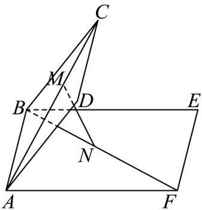

<!-- question-source:start -->
14. 在如图所示的试验装置中，正方形框架 $ABCD$ 的边长为 2，长方形框架 $ABEF$ 的长 $BE = \frac{3}{2} AB$ ，且它们

所在平面形成的二面角 $C - AB - E$ 的大小为 $\frac{\pi}{3}$ ，活动弹子 $M$ ， $N$ 分别在对角线 $AC$ 和 $BF$ 上移动，且始终

保持 $\frac{AM}{AC} = \frac{BN}{BF} = a(0 < a < 1)$ ，则 $MN$ 的长度最小时， $a$ 的取值为 \_\_\_\_。

<!-- question-source:end -->

![[高中/课堂同步/题库/人教A版高中数学同步讲义(2026)/03_选择性必修第一册/月考/阶段测试/高二数学上学期第三次月考_人教A版2019选择性必修第一册全部_高效培/三_填空题_sec_04/questions/answers/Q00062132A1.md]]
