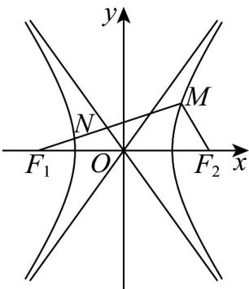

> [!faq]- 《高二数学上学期第三次月考_人教A版2019选择性必修第一册全部_高效培》官方解析
>
> > [!success]- **【答案】** $y = \pm 2x$
>
> > [!note]- **【解析】**
> > 由题可得渐近线 l 的一条方程为 $y = -\frac{b}{a}x$ ，即 bx - ay = 0，
> >
> > 则由题可得 $F(-c,0)$ 到该渐近线的距离为 $\left|NF_{1}\right|=\frac{\left|-bc\right|}{\sqrt{b^{2}+\left(-a\right)^{2}}}=\frac{bc}{\sqrt{c^{2}}}=b$
> >
> > 又 $\left|OF_{1}\right|=c$ ，所以 $\left|ON\right|=a$
> >
> > 由题知 $N$ 为 $MF_{1}$ 的中点，则 $ON / / MF_{2}$ ，所以 $\left|ON\right| = \frac{1}{2}\left|MF_{2}\right|$ ，
> >
> > 故 $\left|MF_{2}\right|=2a,\left|MF_{1}\right|=2b$
> >
> > 又因为 $\left|MF_1\right| - \left|MF_2\right| = 2a$ ，所以 $\left|MF_1\right| = 4a$ ，所以 $2b = 4a$ 即 $\frac{b}{a} = 2$
> >
> > 所以双曲线 C 的渐近线方程为 $y = \pm 2x$
> >
> > 故答案为： $y = \pm 2x$
> >
> > 
