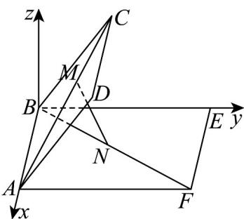

> [!faq]- 《高二数学上学期第三次月考_人教A版2019选择性必修第一册全部_高效培》官方解析
>
> > [!success]- **【答案】** $\frac{8}{23}$
>
> > [!note]- **【解析】**
> > 
> >
> > 由题意知， $AB\perp BC,AB\perp BE$
> >
> > $\therefore \angle CBE$ 就是二面角 $C - AB - E$ 的平面角，即 $\angle CBE = \frac{\pi}{3}$
> >
> > 以 B 为原点，以 BA, BE 所在直线分别为 x, y 轴，过 B 点作 z 轴 ⊥ 平面 ABEF
> >
> > 建立如图所示的空间直角坐标系，
> >
> > 则 $B(0,0,0), A(2,0,0), C(0,1,\sqrt{3}), F(2,3,0)$
> >
> > $\therefore \stackrel{\square}{A} C = (-2,1,\sqrt{3})\quad \stackrel{\square}{B} F = (2,3,0)$
> >
> > 设 $M(x,y,z),N(m,n,0)$
> >
> > 由 $\frac{AM}{AC} = \frac{BN}{BF} = a(0 < a < 1)$ ，可知 $AM = aAC, BN = aBF$ ，
> >
> > $$
> > \therefore (x - 2, y, z) = a (- 2, 1, \sqrt {3}) \quad (m, n, 0) = a (2, 3, 0)
> > $$
> >
> > $$
> > \therefore \left\{ \begin{array}{l} x - 2 = - 2 a \\ y = a \\ z = \sqrt {3} a \end{array} , \left\{ \begin{array}{l} m = 2 a \\ n = 3 a \end{array} , \right. \right.
> > $$
> >
> > 解得 $x = 2 - 2a$
> >
> > $$
> > \therefore M (2 - 2 a, a, \sqrt {3} a), N (2 a, 3 a, 0)
> > $$
> >
> > $$
> > \therefore \left| M N \right| ^ {2} = (2 - 2 a - 2 a) ^ {2} + (a - 3 a) ^ {2} + (\sqrt {3} a) ^ {2}
> > $$
> >
> > $$
> > = 2 3 a ^ {2} - 1 6 a + 4 = 2 3 \left(a - \frac {8}{2 3}\right) ^ {2} + \frac {2 8}{2 3}
> > $$
> >
> > ∴当 $a=\frac{8}{23}$ 时， $\left|MN\right|^{2}$ 取到最小值，即 MN 取到最小值.
> >
> > 故答案为： $\frac{8}{23}$
