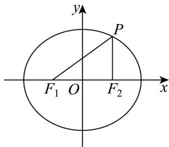

> [!faq]- 《高二数学上学期第三次月考_人教A版2019选择性必修第一册全部_高效培》官方解析
>
> > [!success]- **【答案】** (1)离心率为 $\frac{1}{2}$ ，椭圆方程为 $\frac{x^{2}}{4}+\frac{y^{2}}{3}=1$ ; (2) $\frac{3}{2}$ .
>
> > [!note]- **【解析】**
> > （1）椭圆 $\frac{x^{2}}{16}+\frac{y^{2}}{12}=1$ 的离心率 $e_{2}=\sqrt{1-\frac{b^{2}}{a^{2}}}=\sqrt{1-\frac{12}{16}}=\sqrt{1-\frac{3}{4}}=\sqrt{\frac{1}{4}}=\frac{1}{2}$
> >
> > 对于椭圆 E，焦点为 $F_{1}(-1,0)$ 和 $F_{2}(1,0)$ ，焦距 $2c \neq F_{1}F_{2} \neq 1 - (-1) = 2$ ，所以 c = 1。
> >
> > 又椭圆 $E$ 的离心率 $e_1 = e_2 = \frac{1}{2}$ ，得 $\frac{1}{2} = \frac{1}{a} \Rightarrow a = 2$
> >
> > 再由 $c^2 = a^2 - b^2$ ，得 $b^2 = a^2 - c^2 = 2^2 - 1^2 = 4 - 1 = 3$
> >
> > 所以椭圆 E 的标准方程为 $\frac{x^{2}}{4}+\frac{y^{2}}{3}=1$
> >
> > (2) 椭圆 E 的半长轴 a = 2，
> >
> > 由椭圆的定义知，任意点 $P$ 在椭圆上，有 $\left|PF_1\right| + \left|PF_2\right| = 2a = 4$
> >
> > 联立得 $\left\{ \begin{array}{l} \left|PF_{1}\right| + \left|PF_{2}\right| = 2a = 4 \\ \left|PF_{1}\right|^{2} - \left|PF_{2}\right|^{2} = 4 \end{array} \right.$ ，解方程得 $\left\{ \begin{array}{l} \left|PF_{1}\right| = \frac{5}{2} \\ \left|PF_{2}\right| = \frac{3}{2} \end{array} \right.$ ，
> >
> > 由 $\left(\frac{3}{2}\right)^2 + 2^2 = \left(\frac{5}{2}\right)^2$ 得： $\left|PF_1\right|^2 = \left|PF_2\right|^2 + \left|F_1F_2\right|^2$ ，故 $\angle PF_2F_1 = \frac{\pi}{2}$
> >
> > 故 $\triangle PF_{1}F_{2}$ 的面积 $S = \frac{1}{2}\left|PF_{2}\right|\cdot \left|F_{1}F_{2}\right| = \frac{1}{2}\times \frac{3}{2}\times 2 = \frac{3}{2}.$
> >
> > 
