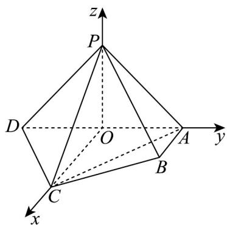

> [!faq]- 《高二数学上学期第三次月考_人教A版2019选择性必修第一册全部_高效培》官方解析
>
> > [!success]- **【答案】** (1)证明见解析(2) $\theta=\frac{\pi}{3}$ (3)存在， $\frac{PM}{PB}=\frac{1}{2}$
>
> > [!note]- **【解析】**
> > （1）证明：取 $AD$ 中点 $O$ ，已知 $PA \perp PD, AD = 4, \therefore OP = 2, OP \perp AD$
> >
> > 又∵ $CA = CD = 2\sqrt{2}$
> >
> > $$
> > \therefore O C \perp A D, O C = 2; \because C P = 2 \sqrt {2} = \sqrt {O P ^ {2} + O C ^ {2}}, \therefore O P \perp O C
> > $$
> >
> > 以 O 为原点，OC, OA, OP 所在直线分别为 x, y, z 轴建系如图，
> >
> > 
> >
> > $$
> > P (0, 0, 2), D (0, - 2, 0), A (0, 2, 0), B (1, 2, 0), \stackrel {{\sqcup \sqcup \sqcup}} {{D P}} = (0, 2, 2), \stackrel {{\sqcup \sqcup \sqcup}} {{A B}} = (1, 0, 0)
> > $$
> >
> > $DP \cdot AB = 0, \therefore DP \perp AB$
> >
> > 又 $PD \perp AP$ ，AB I AP = A， $AB \subset$ 面 PAB， $AP \subset$ 面 PAB，
> >
> > $\therefore PD \perp$ PAB 面，得证；
> >
> > (2) 由 (1) 坐标系， $C(2,0,0), AC = (2,-2,0), DP = (0,2,2), \cos AC, DP = \frac{-4}{2\sqrt{2} \cdot 2\sqrt{2}} = -\frac{1}{2}$
> >
> > 记异面直线 $PD$ ， $AC$ 成角 $\theta ,\cos \theta = |\cos AC,DP| = \frac{1}{2},\theta \in \left(0,\frac{\pi}{2}\right],\therefore \theta = \frac{\pi}{3}$
> >
> > (3) 假设在棱 $PB$ 上存在点 $M$ ，使得平面 $ADM$ 与平面 $ABCD$ 成角余弦值 $\overline{5}$
> >
> > $$
> > \frac {\sqrt {5}}{5}
> > $$
> >
> > 由（1）坐标系， $AP = (0, -2, 2), AD = (0, -4, 0)$
> >
> > 设 $\overline{PM}=\lambda\overline{PB}=(\lambda,2\lambda,-2\lambda),\lambda\in[0,1]$
> >
> > $$
> > A M = A P + P M = (\lambda , 2 \lambda - 2, 2 - 2 \lambda)
> > $$
> >
> > 设 $m=(x_{2},y_{2},z_{2})$ 为平面 ADM 的一个法向量，
> >
> > $\left\{ \begin{array}{l} n \cdot AM = 0 \\ \rightarrow \square \square \\ n \cdot AD = 0 \end{array} \right.$ 即 $\left\{ \begin{array}{l} \lambda x + (2\lambda - 2)y + (2 - 2\lambda)z = 0 \\ -4y = 0 \end{array} \right.$ ，取 $m = (2\lambda - 2, 0, \lambda)$ ，
> >
> > 平面 $ABCD$ 一个法向量 $\overline{OP} = (0,0,2)$
> >
> > 设平面 与平面 夹角， $\cos \alpha = \left|\cos \left\langle \vec{m}, OP \right\rangle\right| = \frac{\left|m \cdot OP\right|}{\left|m\right| \cdot \left|OP\right|} = \frac{\left|2\lambda\right|}{2 \cdot \sqrt{(2\lambda - 2)^2 + \lambda^2}} = \frac{\sqrt{5}}{5}$
> >
> > $$
> > \therefore \lambda = \frac {1}{2}, \therefore \frac {P M}{P B} = \frac {1}{2}
> > $$
