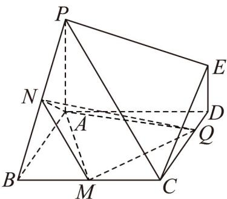

<!-- question-source:start -->
10．如图，在多面体 ABCDEP 中， $PA \perp$ 平面 ABCD ，四边形 ABCD 是正方形，且 DE//PA

$PA = AB = 2DE = 2$ ， $M,N$ 分别是线段 $BC,PB$ 的中点， $Q$ 是线段 $DC$ 上的一个动点（不含端点 $D,C$ ），则

下列说法正确的是（）

A. 存在点 $Q$ ，使得 $NQ \perp PB$

B．不存在点Q，使得异面直线NQ与PE所成的角为 $30^{\circ}$

C．当点Q运动到DC中点时，平面QMN的法向量可以为 $(1,1,2)$

D．三棱锥Q-AMN体积的取值范围为 $\left(\frac{1}{3},\frac{2}{3}\right)$
<!-- question-source:end -->

![[高中/课堂同步/题库/人教A版高中数学同步讲义(2026)/03_选择性必修第一册/月考/高二数学上学期第一次月考（人教A版2019选择性必修第一册第一章1.1_第二章2.3，高效培优·提升卷）/一_选择题/questions/answers/Q00079019A1.md]]
