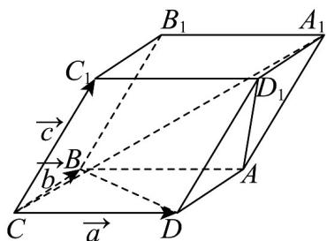

> [!faq]- 《高二数学上学期第一次月考（人教A版2019选择性必修第一册第一章1.1_第二章2.3，高效培优·提升卷）》官方解析
>
> > [!success]- **【答案】**  A. $\frac{\sqrt{5}}{10}$ B. $\frac{\sqrt{10}}{10}$ C. $\frac{\sqrt{5}}{5}$ D. $\frac{\sqrt{2}}{2}$
>
> > [!note]- **【解析】**
> > 
> >
> > 如图，分别取 $CD = a, CB = b, CC_{1} = c$ ，则 $|a| = |b| = |c| = 4$
> >
> > 且 $a \cdot b = 0, a \cdot c = c \cdot b = 4 \times 4 \times \cos 60^{\circ} = 8$
> >
> > 而 $CA_{1} = a + b + c, AD_{1} = c - b,$
> >
> > 由 $\left|AD_{1}\right|=\sqrt{(c-b)^{2}}=\sqrt{c^{2}+b^{2}-2c\cdot b}=\sqrt{16+16-16}=4$
> >
> > $$
> > \left| C A _ {1} \right| = \sqrt {(a + b + c) ^ {2}} = \sqrt {a ^ {2} + b ^ {2} + c ^ {2} + 2 (a \cdot b + a \cdot c + c \cdot b)} = \sqrt {1 6 \times 3 + 8 \times 2 \times 2} = 4 \sqrt {5}
> > $$
> >
> > $$
> > C A _ {1} \cdot A D _ {1} = (a + b + c) \cdot (c - b) = a \cdot c - a \cdot b - b ^ {2} + c ^ {2} = 8 - 0 - 1 6 + 1 6 = 8
> > $$
> >
> > 设 $A_{1}C$ 与 $AD_{1}$ 的所成角为 $\theta$ ，
> >
> > 则 $\cos\theta=|\cos\langle CA_{1},AD_{1}\rangle|=\frac{|\overrightarrow{GA_{1}}\cdot\overrightarrow{AD_{1}}|}{|CA_{1}|\cdot|AD_{1}|}=\frac{8}{4\sqrt{5}\times4}=\frac{\sqrt{5}}{10}$
> >
> > 故选 **A**.
