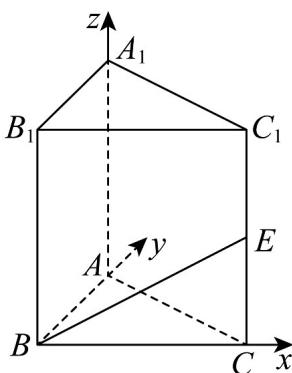

> [!faq]- 《高二数学上学期第一次月考（人教A版2019选择性必修第一册第一章1.1_第二章2.3，高效培优·提升卷）》官方解析
>
> > [!success]- **【答案】** 侧棱 $CC_{1}$ 的中点，则下列直线中与 $BE$ 垂直的是（ ）A. $AC$ B. $A_{1}C$ C. $AB_{1}$ D. $A_{1}B$
>
> > [!note]- **【解析】**
> > 因为三棱柱 $ABC-A_{1}B_{1}C_{1}$ 是直三棱柱，且底面 VABC 是以 AC 为斜边的等腰直角三角形，
> >
> > 所以 $BA, BC, BB_{1}$ 两两垂直，
> >
> > 以 $B$ 为原点， $BA, BC, BB_{1}$ 所在直线分别为 $x, y, z$ 轴建立如图所示坐标系，
> >
> > 
> >
> > 由题意可得 $A(0,2,0)$ ， $C(2,0,0)$ ， $A_{1}(0,2,2\sqrt{2})$ ， $B_{1}(0,0,2\sqrt{2})$ ， $E(2,0,\sqrt{2})$
> >
> > 所以 $\overset{\square\square\square\square}{BE}=\left(2,0,\sqrt{2}\right)$ ， $\overset{\square\square\square\square}{AC}=\left(2,-2,0\right)$ ， $\overset{\square\square\square\square}{A_{1}C}=\left(2,-2,-2\sqrt{2}\right)$ ， $\overset{\square\square\square\square}{AB_{1}}=\left(0,-2,2\sqrt{2}\right)$ ， $\overset{\square\square\square\square}{A_{1}B}=\left(0,-2,-2\sqrt{2}\right)$
> >
> > 所以 $\overset{\square\square}{BE}\cdot\overset{\square\square}{AC}=2\times2+0\times(-2)+\sqrt{2}\times0=4,\quad\overset{\square\square}{BE}\cdot\overset{\square\square}{A_{1}}C=2\times2+0\times(-2)+\sqrt{2}\times(-2\sqrt{2})=0$
> >
> > $$
> > \stackrel {{\square \sqcup \sqcup}} {B E} \cdot \stackrel {{\square \sqcup \sqcup}} {A B _ {1}} = 2 \times 0 + 0 \times (- 2) + \sqrt {2} \times 2 \sqrt {2} = 4 \quad \stackrel {{\square \sqcup \sqcup}} {B E} \cdot \stackrel {{\square \sqcup \sqcup}} {A _ {1} B} = 2 \times 0 + 0 \times (- 2) + \sqrt {2} \times (- 2 \sqrt {2}) = - 4
> > $$
> >
> > 所以 $BE \perp A_{1}C$
> >
> > 故选 **B**
