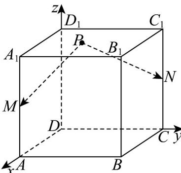

> [!faq]- 《高二数学上学期第一次月考（人教A版2019选择性必修第一册第一章1.1_第二章2.3，高效培优·提升卷）》官方解析
>
> > [!success]- **【答案】** D
>
> > [!note]- **【解析】**
> > 以点 $D$ 为原点，以 $\overline{DA},\overline{DC},\overline{DD}_1$ 分别为 $x,y,z$ 轴的正方向建立空间直角坐标系，
> >
> > 
> >
> > $M(2,0,1)\quad N(0,2,1)\quad P(x,y,z)\quad \overline{PM} = (2 - x, - y,1 - z)$
> >
> > $$
> > P N = (- x, 2 - y, 1 - z)
> > $$
> >
> > 所以 $\overline{PM} \cdot \overline{PN} = x(x - 2) + y(y - 2) + (z - 1)^{2} = -\frac{1}{8}$
> >
> > 即 $\left(x - 1\right)^2 +\left(y - 1\right)^2 +\left(z - 1\right)^2 = \frac{15}{8}$ ，此方程表示以 $(1,1,1)$ 为球心，以 $\frac{\sqrt{30}}{4}$ 为半径的球，
> >
> > 球心到每个面的距离都是1，每个平面与球的截面圆的半径为 $\sqrt{\left(\frac{\sqrt{30}}{4}\right)^2 - 1} = \frac{\sqrt{14}}{4} < 1$
> >
> > 所以点 $P$ 的轨迹是以每一个正方形的中点为圆心的圆，所以轨迹长度为 $6 \times 2\pi \times \frac{\sqrt{14}}{4} = 3\sqrt{14}\pi$
> >
> > 故选：D
> >
> > 5. 直线 $l_{1}:(a + 1)x + y - 1 = 0, l_{2}:2x + ay + a - 2 = 0$ ，则“ $l_{1} // l_{2}$ ”的充要条件是（）
> >
> > 【答案】
> >
> > A. $a = 1$ B. $a = -2$ C. $a = 1$ 或-2 D.以上均不对
> >
> > 【答案】B
> >
> > 【详解】因为直线 $l_{1}:(a + 1)x + y - 1 = 0,l_{2}:2x + ay + a - 2 = 0$
> >
> > 当 $l_{1}//l_{2}$ 时， $(a+1)a=2$ ，解得a=1或-2，
> >
> > 当 $a = 1$ 时， $l_{1}:2x + y - 1 = 0, l_{2}:2x + y - 1 = 0$ ，此时两直线重合，舍去，
> >
> > 又 $a = -2$ 时， $l_{1}: x - y + 1 = 0, l_{2}: x - y - 2 = 0$ ，此时 $l_{1} // l_{2}$
> >
> > 所以“ $l_{1} // l_{2}$ ”的充要条件是“ $a = -2$ ”.
> >
> > 故选 **B**.
