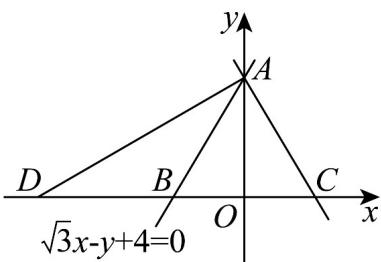

> [!faq]- 《高二数学上学期第一次月考（人教A版2019选择性必修第一册第一章1.1_第二章2.3，高效培优·提升卷）》官方解析
>
> > [!success]- **【答案】** A
>
> > [!note]- **【解析】**
> > 如图，设 $A(0,4)$ ，直线 $\sqrt{3} x - y + 4 = 0$ 过 $A(0,4)$ 和 $B\left(-\frac{4}{\sqrt{3}},0\right)$
> >
> > 
> > - **①**：当直线 $l$ 为 $x = 0$ 时，直线 $l$ 、直线 $\sqrt{3} x - y + 4 = 0$ 与 $x$ 轴围成的三角形是VAOB，不是等腰三角形，所以
> >
> > 直线 $l$ 的斜率存在.
> > - **②**：当直线 l 的斜率为负时，设 B 关于 y 轴的对称点为 $C\left(\frac{4}{\sqrt{3}},0\right)$ ，当直线 l 过 A, C 两点时，AB = AC, $\triangle ABC$ 是
> >
> > 等腰三角形，
> >
> > 又 $\angle ABC = \frac{\pi}{3}$ ，所以VABC为等边三角形，满足题意，因为 $OA = 4,OC = \frac{4}{\sqrt{3}}$ ，所以此时直线 $l$ 的方程为 $\sqrt{3} x + y - 4 = 0$
> > - **③**：当直线 l 的斜率为正时，设直线 l 与 x 轴负半轴相交于点 D，则 AB = BD，由直线 AB 的斜率为 $\sqrt{3}$ ，倾斜角为 $\frac{\pi}{3}$ ，可得 $\angle ADB = \frac{\pi}{6}$ ，
> >
> > 所以直线 $AD$ ，也即直线 $l$ 的斜率为 $\frac{\sqrt{3}}{3}$ ，对应方程为 $\sqrt{3} x - 3y + 12 = 0$
> >
> > 综上，直线 $l$ 的方程为 $\sqrt{3} x + y - 4 = 0$ 或 $\sqrt{3} x - 3y + 12 = 0$
> >
> > 故选 **A**.
