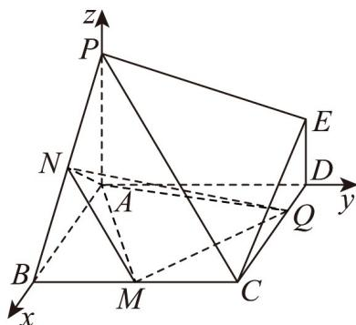
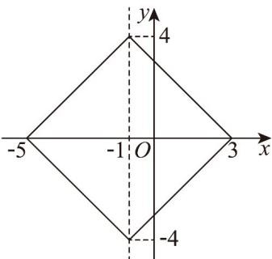
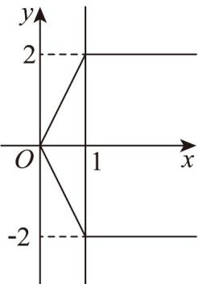

> [!faq]- 《高二数学上学期第一次月考（人教A版2019选择性必修第一册第一章1.1_第二章2.3，高效培优·提升卷）》官方解析
>
> > [!success]- **【答案】** BCD
>
> > [!note]- **【解析】**
> > 以 A 为坐标原点，以 AB, AD, AP 所在直线分别为 x, y, z 轴，
> >
> > 建立如图所示的空间直角坐标系，
> >
> > 则 $A(0,0,0), B(2,0,0), E(0,2,1), P(0,0,2), N(1,0,1), M(2,1,0)$
> >
> > 对于 A，假设存在点 $Q(m,2,0)(0<m<2)$ ，使得 $NQ \perp PB$
> >
> > 因为 $\overline{NQ} = (m - 1, 2, -1)$ ， $\overline{PB} = (2, 0, -2)$ ，所以 $\overline{NQ} \cdot \overline{PB} = 2(m - 1) + 2 = 0$
> >
> > 解得 m = 0 ，不合题意，故 A 错误；
> >
> > 对于 B，假设存在点 $Q(m,2,0)(0<m<2)$ ，使得异面直线 NQ 与 PE 所成的角为 $30^{\circ}$
> >
> > 因为 $NQ = (m - 1, 2, -1)$ ， $PE = (0, 2, -1)$
> >
> > 所以 $\left|\cos NQ, PE\right|=\frac{\left|\overrightarrow{NQ}\cdot\overrightarrow{PE}\right|}{\left|NQ\right|\left|PE\right|}=\frac{5}{\sqrt{(m-1)^{2}+5}\times\sqrt{5}}=\cos30^{\circ}=\frac{\sqrt{3}}{2}$
> >
> > 解得 $m=1\pm\frac{\sqrt{15}}{3}$ ，不符合0<m<2，
> >
> > 则不存在点 $Q$ ，使得异面直线 $NQ$ 与 $PE$ 所成的角为 $30^{\circ}$ ，故B正确；
> >
> > 对于 C，当点 $Q_{运动到}DC$ 中点时， $Q(1,2,0)$ ，又 $N(1,0,1)$ ， $M(2,1,0)$
> >
> > 所以 $\stackrel{\square\square}{N}Q=\left(0,2,-1\right)$ $\stackrel{\square\square\square\square}{NM}=\left(1,1,-1\right)$
> >
> > 设 $n_{1}=\left(x,y,z\right)$ 是平面 QMN 的法向量，
> >
> > 则 $\left\{ \begin{array}{l}n_{1}\cdot NQ = 2y - z = 0\\ n_{1}\cdot NM = x + y - z = 0 \end{array} \right.$ ，令 $y = 1$ ，则 $\stackrel {\sqcup}{n_1} = (1,1,2)$ ，故C正确；
> >
> > 对于 D，方法一 因为 $AN = (1, 0, 1)$ ， $AM = (2, 1, 0)$
> >
> > 所以 $\cos AN, AM = \frac{AN \cdot AM}{|AN||AM|} = \frac{2}{\sqrt{2} \times \sqrt{5}} = \frac{\sqrt{10}}{5}$
> >
> > $\sin AN, AM = \sqrt{1 - \left(\frac{\sqrt{10}}{5}\right)^2} = \frac{\sqrt{15}}{5}$ ，则 $S_{\triangle AMN} = \frac{1}{2}\left|AN\right|\left|AM\right| \cdot \sin AN, AM = \frac{1}{2} \times \sqrt{2} \times \sqrt{5} \times \frac{\sqrt{15}}{5} = \frac{\sqrt{6}}{2}$ ，
> >
> > 设 $n_2 = (x_1, y_1, z_1)$ 是平面 $AMN$ 的法向量，则 $\left\{ \begin{array}{l} n_2 \cdot AN = x_1 + z_1 = 0 \\ n_2 \cdot AM = 2x_1 + y_1 = 0 \end{array} \right.$ ，
> >
> > 令 $x_{1} = 1$ ，则 $n_2 = (1, - 2, - 1)$ ，设 $Q(m,2,0)(0 <   m <   2)$
> >
> > 则 $AQ = (m, 2, 0)(0 < m < 2)$
> >
> > 则点 $Q$ 到平面 $AMN$ 的距离 $d = \frac{\left|AQ \cdot n_2\right|}{\left|n_2\right|} = \frac{4 - m}{\sqrt{6}}$
> >
> > 则三棱锥 $Q - AMN$ 的体积为 $\frac{1}{3} \times \frac{4 - m}{\sqrt{6}} \times \frac{\sqrt{6}}{2} = \frac{4 - m}{6}$
> >
> > 因为 0 < m < 2，所以 $V_{Q-AMN} \in \left( \frac{1}{3}, \frac{2}{3} \right)$ ，故 D 正确。
> >
> > 方法二 设 $DQ = m (0 < m < 2)$ ，则 CQ = 2 - m，
> >
> > 因为 $S_{\triangle AMQ} = S_{正方形ABCD} - S_{\triangle ABM} - S_{\triangle QCM} - S_{\triangle ADQ}$
> >
> > $$
> > = 4 - 1 - \frac {1}{2} (2 - m) - m = 2 - \frac {m}{2}
> > $$
> >
> > 点 N 到平面 AMQ 的距离 $d = \frac{1}{2} PA = 1$ ，
> >
> > 所以 $V_{Q-AMN}=V_{N-AMQ}=\frac{1}{3}\left(2-\frac{m}{2}\right)\times1=\frac{2}{3}-\frac{m}{6}$ ，因为0<m<2
> >
> > 所以 $V_{Q-AMN} \in \left( \frac{1}{3}, \frac{2}{3} \right)$ ，故 D 正确。
> >
> > 故选：BCD.
> >
> > 
> >
> > 11．“曼哈顿距离”是由赫尔曼·闵可夫斯基首先提出的，是一种使用在几何度量空间的几何学用语。在平面直角坐标系 $xOy$ 中， $O$ 是坐标原点，定义点 $P(x_1, y_1)$ 与点 $Q(x_2, y_2)$ 的曼哈顿距离为 $d(P, Q) = |x_1 - x_2| + |y_1 - y_2|$ 。若点 $F_1(-1,0)$ ，点 $F_2(1,0)$ ，直线 $a, b$ 和 $c$ 的方程分别是 $x - 2y - 2 = 0, x = -1$ 和 $x = 1$ ，则下列叙述正确的是（）
> >
> > 【答案】
> >
> > A. $d(F_1, F_2) = \sqrt{2}$ B．点 $O$ 与直线 $a$ 上任意一点的曼哈顿距离最小值为 2
> >
> > C．若动点 $M$ 满足 $d(M, F_1) = 4$ ，则 $M$ 的轨迹围成图形的面积是 32
> >
> > D．若动点 $M$ 与直线 $b$ 上任意一点的曼哈顿距离最小值等于 $d(M, F_2)$ ，则 $M$ 的轨迹与直线 $c$ 围成的封闭图形面积是 2
> >
> > 【答案】CD
> >
> > 【详解】对于 A， $d(F_{1}, F_{2}) = |-1 - 1| + |0 - 0| = 2$ ，A 错误；
> >
> > 对于 B，令直线 a 上任意点为 $A(2y+2,y)$ ，
> >
> > $$
> > d (O, A) = 2 | y + 1 | + | y | = \left\{ \begin{array}{l} - 3 y - 2, y <   - 1 \\ y + 2, - 1 \leq y <   0 \\ 3 x + 2, y \quad 0 \end{array} \right.
> > $$
> >
> > 则当 $y = -1$ 时， $d(O, A)$ 的最小值为1，B错误；
> >
> > 对于 C，设 $M(x,y)$ ，则 $d(M,F_{1})=|x+1|+|y|=4$
> >
> > 当 $x < -1, y < 0$ 时，则 $x + y + 5 = 0$ ；当 $x < -1, y = 0$ 时，则 $x - y + 5 = 0$ ；
> >
> > 当 $x - 1, y < 0$ 时，则 $x + y - 3 = 0$ ；当 $x - 1, y = 0$ 时，则 $x + y - 3 = 0$ ；
> >
> > 则 $M$ 点轨迹为上述四条线段围城的封闭曲线，如图示正方形：
> >
> > 
> >
> > 则 $M$ 的轨迹围成图形的面积是 $\frac{1}{2} \times 8 \times 8 = 32$ ，C 正确；
> >
> > 对于D，设 $M(x,y)$ ，当 $M$ 与直线 $b$ 上的点连线垂直于 $b$ 时曼哈顿距离最小，由此可得
> >
> > $$
> > \mid x + 1 \mid = \mid x - 1 \mid + \mid y \mid
> > $$
> >
> > 当 $x < -1$ 时， $-x - 1 = 1 - x + |y|$ ，则 $|y| = -2$ ，不符合题意；
> >
> > 当 $-1 \leq x < 0$ 时， $x + 1 = 1 - x + |y|$ ，则 $|y| = 2x < 0$ ，不符合题意；
> >
> > 当 $0 \leq x < 1, y < 0$ 时， $x + 1 = 1 - x - y$ ，则 $2x + y = 0$
> >
> > 当 $0 \leq x < 1, y$ 0时， $x + 1 = 1 - x + y$ ，则 $2x - y = 0$
> >
> > 当 $x = 1, y < 0$ 时， $x + 1 = x - 1 - y$ ，则 $y = -2$
> >
> > 当 $x = 1, y = 0$ 时， $x + 1 = x - 1 + y$ ，则 $y = 2$
> >
> > 则 $M$ 点轨迹如图示：
> >
> > 
> >
> > 则 $M$ 的轨迹与直线 $c$ 围成的封闭图形面积为 $\frac{1}{2} \times 1 \times 4 = 2$ ，D 正确，
> >
> > 故选 **CD**
