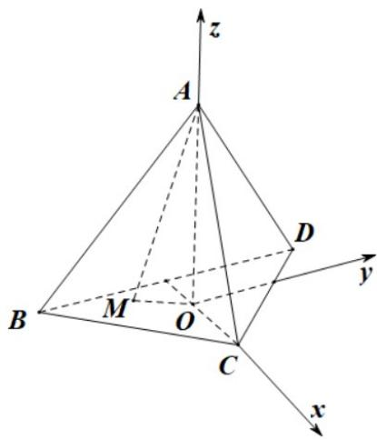

> [!faq]- 《高二数学上学期第一次月考（人教A版2019选择性必修第一册第一章1.1_第二章2.3，高效培优·提升卷）》官方解析
>
> > [!success]- **【答案】** 7
>
> > [!note]- **【解析】**
> > 因为 $a, b, c$ 共面，
> >
> > 所以 $(2, -1, 2) = x(-1, 3, -3) + y(1, \lambda, -5)$
> >
> > 即 $\left\{ \begin{array}{l} 2 = -x + y \\ -1 = 3x + \lambda y \\ 2 = -3x - 5y \end{array} \right.$ ，解得： $\left\{ \begin{array}{l} x = -\frac{3}{2} \\ y = \frac{1}{2} \\ \lambda = 7 \end{array} \right.$
> >
> > 故答案为：7
> >
> > 14．棱长为 $\sqrt{6}$ 的正四面体 A-BCD 中，点 M 为平面 BCD 内的动点，且满足 $AM = \sqrt{5}$ ，点 G 为 $\triangle ABD$ 的
> >
> > 重心，则直线 AM 与直线 CG 所成角的余弦值的最大值为 \_\_\_\_。
> >
> > 【答案】 $\frac{2\left(\sqrt{10}+\sqrt{5}\right)}{15}$
> >
> > 【详解】根据题意，记A在底面BCD内的摄影为O，则 $AO \perp$ 平面BCD，
> >
> > 又 $CO, OM \subset$ 平面 $BCD$ ，故 $AO \perp CO$ ， $AO \perp OM$ ；
> >
> > 利用正四棱锥性质可得 $CO=\frac{2}{3}\times\frac{\sqrt{6}}{2}\times\sqrt{3}=\sqrt{2}$ ，所以 $AO=\sqrt{6-2}=2$ ，
> >
> > 又因为 $AM = \sqrt{5}$ ，则 $OM = \sqrt{5 - 2^{2}} = 1$ ，
> >
> > 可知点 $M$ 的轨迹是以 $O$ 为圆心，半径为1的圆，
> >
> > 因为 $\triangle BCD$ 内切圆半径为 $\frac{\sqrt{3}}{3} \times \sqrt{6} = \frac{\sqrt{2}}{2} < 1$
> >
> > 所以点 $M$ 的轨迹是以 $O$ 为圆心的三段圆弧，
> >
> > 以 $O$ 为坐标原点， $OC,OA$ 所在直线分别为 $x,z$ 轴，在平面 $BCD$ 内过 $O$ 作平行于 $BD$ 的直线为 $y$ 轴，建立空
> >
> > 间直角坐标系，如下图所示：
> >
> > 
> >
> > 设 $M(\cos \alpha, \sin \alpha, 0), \alpha \in \left[0, \frac{\pi}{12}\right] \cup \left[\frac{7\pi}{12}, \frac{3\pi}{4}\right] \cup \left[\frac{5\pi}{4}, \frac{17\pi}{12}\right] \cup \left[\frac{23\pi}{12}, 2\pi\right]$
> >
> > 易知 $A(0,0,2),B\left(-\frac{\sqrt{2}}{2}, - \frac{\sqrt{6}}{2},0\right),D\left(-\frac{\sqrt{2}}{2},\frac{\sqrt{6}}{2},0\right),C(\sqrt{2},0,0)$
> >
> > 又点 $G$ 为 $\triangle ABD$ 的重心，可得 $G\left(-\frac{\sqrt{2}}{3},0,\frac{2}{3}\right)$
> >
> > 因此 $\overrightarrow{AM} = (\cos \alpha, \sin \alpha, -2), \overrightarrow{CG} = \left(-\frac{4\sqrt{2}}{3}, 0, \frac{2}{3}\right)$
> >
> > 设直线 $AM$ 与直线 $CG$ 所成的角为 $\theta$
> >
> > 则可得 $\cos \theta = \left|\cos AM, CG\right| = \frac{\left|\overrightarrow{AM} \cdot \overrightarrow{CG}\right|}{\left|\overrightarrow{AM}\right|\left|\overrightarrow{CG}\right|} = \frac{\left| -\frac{4\sqrt{2}}{3}\cos\alpha + \left(-\frac{4}{3}\right)\right|}{\sqrt{1 + 4} \times 2} = \frac{\left|\frac{4\sqrt{2}}{3}\cos\alpha + \frac{4}{3}\right|}{2\sqrt{5}}$
> >
> > 当 $\cos \alpha = 1$ 时， $\cos \theta = \frac{\left|\frac{4\sqrt{2}}{3}\cos \alpha + \frac{4}{3}\right|}{2\sqrt{5}} = \frac{4(\sqrt{2} + 1)}{3 \times 2\sqrt{5}} = \frac{2(\sqrt{10} + \sqrt{5})}{15}$ 取得最大值.
> >
> > 因此直线 $AM$ 与直线 $CG$ 所成角的余弦值的最大值为 $\frac{2\left(\sqrt{10} + \sqrt{5}\right)}{15}$
> >
> > 故答案为： $\frac{2\left(\sqrt{10}+\sqrt{5}\right)}{15}$
