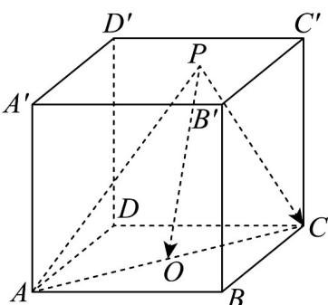

<!-- question-source:start -->
15. (13分)

如图，已知正方体 $ABCD - A'B'C'D'$ 的棱长为 1.

(1)求 $A^{\prime}B\cdot B^{\prime}C$ 的值；

(2) $P$ 是底面 $A'B'C'D'$ 上一点（包括边界），求 $\overline{PA} \cdot \overline{PC}$ 的取值范围.
<!-- question-source:end -->

![[高中/课堂同步/题库/人教A版高中数学同步讲义(2026)/03_选择性必修第一册/月考/高二数学上学期第一次月考（人教A版2019选择性必修第一册第一章1.1_第二章2.3，高效培优·提升卷）/四_解答题/questions/answers/Q00079022A1.md]]
