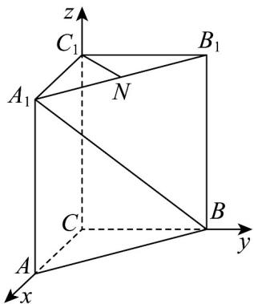
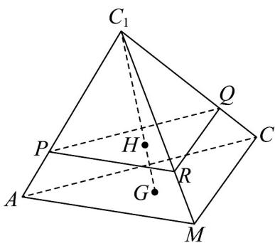

> [!faq]- 《高二数学上学期第一次月考（人教A版2019选择性必修第一册第一章1.1_第二章2.3，高效培优·提升卷）》官方解析
>
> > [!success]- **【答案】** (1)证明见解析 (2)存在， $\frac{AF}{FB}=1$ (3)证明见解析，4
>
> > [!note]- **【解析】**
> > （1）以 $C$ 为原点，分别以 $CA$ 、 $CB$ 、 $CC_{1}$ 所在直线为 $x$ 、 $y$ 、 $z$ 轴建立空间直角坐标系，
> >
> > 
> >
> > $\because CA = CB = 1 \angle BCA = 90^{\circ} AA_{1} = 2$
> >
> > 则 $A(1,0,0)$ 、 $B(0,1,0)$ 、 $A_{1}(1,0,2)$ 、 $B_{1}(0,1,2)$ 、 $C_{1}(0,0,2)$
> >
> > Q N 是 $A_{1}B_{1}$ 的中点，则 $N\left(\frac{1}{2},\frac{1}{2},2\right)$ ， $A_{1}B=\left(-1,1,-2\right)$ ， $C_{1}N=\left(\frac{1}{2},\frac{1}{2},0\right)$
> >
> > ∵ $A_{1}B \cdot C_{1}N = -1 \times \frac{1}{2} + 1 \times \frac{1}{2} + (-2) \times 0 = 0$ ，∴ $A_{1}B \perp C_{1}N$ ，即 $A_{1}B \perp C_{1}N$ 。
> >
> > (2) 设 $AF = \lambda AB = \lambda (-1, 1, 0) = (-\lambda, \lambda, 0)$ ，其中 $0 \leq \lambda \leq 1$ ， $AB = (-1, 1, 0)$ ，则 $F(1 - \lambda, \lambda, 0)$
> >
> > $$
> > \therefore \stackrel {\sqcup \sqcup \sqcup} {C _ {1} C} = (0, 0, - 2) \quad \stackrel {\sqcup \sqcup \sqcup} {C F} = (1 - \lambda , \lambda , 0)
> > $$
> >
> > 若 $AB \perp$ 面 $C_1CF$ ，则 $\left\{ \begin{array}{ll} AB \cdot C, C = 0 \\ AB \cdot CF = -(1 - \lambda) + \lambda = 0 \end{array} \right.$ ，解得 $\lambda = \frac{1}{2}$ ， $\therefore \frac{AF}{AB} = 1$ ，
> >
> > 故存在点 $F$ ，当 $\frac{AF}{FB} = 1$ 时， $AB\perp$ 面 $C_1CF$
> >
> > (3) 因为 G 为 $\triangle AMC$ 的重心，则 $GA + GM + GC = 0$
> >
> > 
> >
> > 即 $\overline{C_1A} -\overline{C_1G} +\overline{C_1M} -\overline{C_1G} +\overline{C_1C} -\overline{C_1G} = 0$ ，可得 $\overline{C_1G} = \frac{1}{3}\left(\overline{C_1A} +\overline{C_1M} +\overline{C_1C}\right)$
> >
> > 因为 $H$ 为 $C_1G$ 上一点，且 $C_1H:HG = 3:1$ ，则 $\overline{C_1H} = \frac{3}{4}\overline{C_1G} = \frac{1}{4}\left(\overline{C_1A} +\overline{C_1M} +\overline{C_1C}\right)$
> >
> > 因为 $P$ 、 $R$ 、 $Q$ 、 $H$ 四点共面，则存在 $\lambda$ 、 $\mu \in \mathbf{R}$ ，使得 $PH = \lambda PQ + \mu PR$
> >
> > 即 $C_1H - C_1P = \lambda \left(C_1Q - C_1P\right) + \mu \left(C_1R - C_1P\right)$
> >
> > 所以 $C_{1}H=\left(1-\lambda-\mu\right)C_{1}P+\lambda C_{1}Q+\mu C_{1}R=\left(1-\lambda-\mu\right)mC_{1}A+\lambda nC_{1}C+\mu tC_{1}M$
> >
> > 又因为 $\overline{C_{1}H}=\frac{1}{4}\left(\overline{C_{1}A}+\overline{C_{1}M}+\overline{C_{1}C}\right)$ ，且 $\overline{C_{1}A}$ 、 $\overline{C_{1}M}$ 、 $\overline{C_{1}C}$ 不共面，
> >
> > 由空间向量的基本定理可得 $\left\{ \begin{array}{l} (1 - \lambda - \mu)m = \frac{1}{4}\\ \lambda n = \frac{1}{4}\\ \mu t = \frac{1}{4} \end{array} \right.$
> >
> > 因此， $\frac{1}{m} +\frac{1}{n} +\frac{1}{t} = 4(1 - \lambda -\mu) + 4\lambda +4\mu = 4$ 为定值
