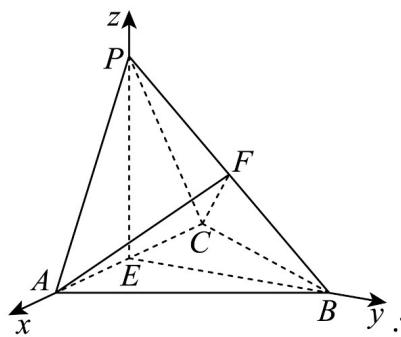
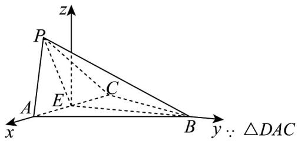

> [!faq]- 《高二数学上学期第一次月考（人教A版2019选择性必修第一册第一章1.1_第二章2.3，高效培优·提升卷）》官方解析
>
> > [!success]- **【答案】** (1)证明见解析； (2) $\frac{1}{3}$ ; (3) $\frac{\sqrt{2}}{4}$
>
> > [!note]- **【解析】**
> > （1）取 AC 中点为 E，连接 PE，BE，
> >
> > ∵ PA = PC $\quad AB = BC$ ∴ PE ⊥ AC $\quad BE \perp AC$
> >
> > 又 $PE \cap BE = E$ ， $PE$ 、 $BE \subset$ 平面 $PBE$ ， $\therefore AC \perp$ 平面 $PBE$ ，又 $PB \subset$ 平面 $PBE$ ， $\therefore AC \perp PB$
> >
> > (2) $\because$ 平面 $PAC \perp$ 平面 $ACB$ ，平面 $PAC \cap$ 平面 $ACB = AC$ ， $PE \perp AC$ ， $PE \subset$ 平面 $PAC$
> >
> > ∴ $PE \perp$ 平面 ACB ，易知 EA ， EP ， EB 两两互相垂直，
> >
> > 以 E 为原点，以 $\{EA, EB, EP\}$ 为基底，建立空间直角坐标系，
> >
> > 
> >
> > $$
> > B (0, \sqrt {2}, 0)
> > $$
> >
> > $$
> > F (0, \frac {\sqrt {2}}{2}, \frac {1}{2})
> > $$
> >
> > $\therefore \stackrel{\mathrm{uu}}{PB} = (0, \sqrt{2}, -1)$ ， $\stackrel{\mathrm{uu}}{CA} = (2, 0, 0)$ ， $\stackrel{\mathrm{u}\vec{\mathrm{u}}}{CF} = (1, \frac{\sqrt{2}}{2}, \frac{1}{2})$
> >
> > 设平面 $_{ACF}$ 的法向量为 $m=(x_{1},y_{1},z_{1})$ ，则 $\left\{\begin{aligned}&CA\cdot m=2x_{1}=0\\&CF\cdot m=x_{1}+\frac{\sqrt{2}}{2}y_{1}+\frac{1}{2}z_{1}=0\end{aligned}\right.$ ，
> >
> > 取 $y_{1} = -1$ ，得 $m = (0, - 1, \sqrt{2})$ ，∴ $\cos PB, m = \frac{\overrightarrow{PB} \cdot m}{\left|PB\right|\cdot\left|m\right|} = \frac{-\sqrt{2} - \sqrt{2}}{\sqrt{3} \times \sqrt{3}} = -\frac{2\sqrt{2}}{3}$
> >
> > 设直线 $PB$ 与平面 $ACF$ 所成角为 $\theta$ ，则 $\sin \theta = \frac{2\sqrt{2}}{3}$ ，又 $\theta \in [0, \frac{\pi}{2}]$ ，
> >
> > ∴ 直线 PB 与平面 ACF 所成角的余弦值为 $\frac{1}{3}$ .
> >
> > (3) 以 $E$ 为原点，以 $EA$ 为 $x$ 轴， $EB$ 为 $y$ 轴，垂直于平面 $ABC$ 所在直线为 $z$ 轴，建立空间直角坐标系，
> >
> > 
> >
> > 为等腰三角形，
> >
> > $$
> > D A = D C = \sqrt {2}
> > $$
> >
> > ∴ EP = 1 ，则 $A(1,0,0)$ ， $B(0,\sqrt{2},0)$ ， $C(-1,0,0)$ ，
> >
> > 设 $\angle BEP = \theta$ ，则 $P(0,\cos \theta ,\sin \theta)$ ，则 $\overline{PC} = (-1, - \cos \theta , - \sin \theta)$ ， $\overline{AB} = (-1,\sqrt{2},0)$
> >
> > $$
> > \left| \cos P C, A B \right| = \left| \frac {P C \cdot A B}{| P C | | A B} \right| = \left| \frac {1 - \sqrt {2} \cos \theta}{\sqrt {2} \times \sqrt {3}} \right| = \frac {\sqrt {6}}{4},
> > $$
> >
> > $$
> > \therefore \cos \theta = - \frac {\sqrt {2}}{4} \text {或} \cos \theta = \frac {5 \sqrt {2}}{4} (\text {舍}), \text {又} \alpha \in [ 0, \frac {\pi}{2} ]
> > $$
> >
> > $\cos \alpha = |\cos \theta| = \frac{\sqrt{2}}{4}$
