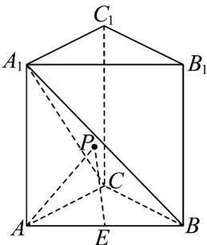

<!-- question-source:start -->
7. 如图，在直三棱柱 $ABC - A_{1}B_{1}C_{1}$ 中， $AC \perp AB$ ， $AC = AB = CC_{1} = 1$ ， $E$ 是线段 $AB$ 的中点，在 $\triangle A_{1}BC$ 内

有一动点 $P$ （包括边界），则 $\left|\overline{PA}\right| + \left|\overline{PE}\right|$ 的最小值是（ ）.

A. $\frac{\sqrt{33}}{2}$ B. $\frac{2\sqrt{33}}{3}$ C. $\frac{\sqrt{33}}{6}$ D. $\frac{\sqrt{33}}{3}$
<!-- question-source:end -->

![[高中/课堂同步/题库/人教A版高中数学同步讲义(2026)/03_选择性必修第一册/月考/高二数学上学期第一次月考（人教A版2019选择性必修第一册第一章_第二章，高效培优·强化卷）/一_选择题/questions/answers/Q00079033A1.md]]
