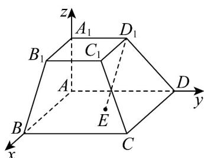

<!-- question-source:start -->
10．已知四棱台 $ABCD - A_{1}B_{1}C_{1}D_{1}$ 的上、下底面均为正方形， $AA_{1} \perp$ 底面 $ABCD$ ， $AA_{1} = \frac{1}{2}$

$AB = 2A_{1}B_{1} = \sqrt{3}$ ， $E$ 是底面 $ABCD$ 的中心，以 ${}^{\mathrm{A}}$ 为原点， $AB$ ， $AD$ ， $AA_{1}$ 所在直线分别为 $x,y,z$ 轴建立空

间直角坐标系，如图所示，则下列说法正确的是（）

A. 点 $D_{1}$ 的坐标为 $\left(0, \frac{\sqrt{3}}{2}, \frac{1}{2}\right)$ B. $\left|\overrightarrow{D_1E}\right| = \frac{\sqrt{3}}{2}$ C. 平面 $BB_{1}C_{1}C$ 的一个法向量为 $(1,0,\sqrt{3})$ D. 点 $D_{1}$ 到平面 $BB_{1}C_{1}C$ 的距离为 $\frac{\sqrt{3}}{3}$
<!-- question-source:end -->

![[高中/课堂同步/题库/人教A版高中数学同步讲义(2026)/03_选择性必修第一册/月考/高二数学上学期第一次月考（人教A版2019选择性必修第一册第一章_第二章，高效培优·强化卷）/一_选择题/questions/answers/Q00079036A1.md]]
