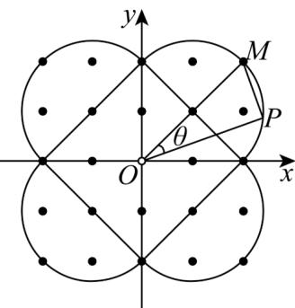

> [!faq]- 《高二数学上学期第一次月考（人教A版2019选择性必修第一册第一章_第二章，高效培优·强化卷）》官方解析
>
> > [!success]- **【答案】** (1) 若 $A, B$ 为曲线 $C$ 上两点，则 $\left|AB\right|$ 的最大值为 $4\sqrt{2}$ (2) 曲线 C 围成的图形的面积是 $4\pi + 8$ (3) 若 $P(x, y)$ 为曲线 $C$ 上一点，则 $x^{2} + y^{2}$ 的最小值为 4(4) 曲线 C 围成区域内(含曲线 C)格点(横坐标与纵坐标都为整数的点)的个数为 20 A.1 B.2 C.3 D.4
>
> > [!note]- **【解析】**
> > 当 $x > 0$ ， $y > 0$ 时，由曲线 $C$ 的方程，得 $(x - 1)^2 + (y - 1)^2 = 2$
> >
> > 曲线 C 在第一象限内的部分是圆心为 $(1,1)$ ，半径为 $\sqrt{2}$ 的圆弧.
> >
> > 同理，曲线 $C$ 在第二、三、四象限内的部分都是圆弧，
> >
> > 当 x=0 时， $y=\pm2$ ；当 y=0 时， $x=\pm2$ .
> >
> > 曲线 C 在坐标系中如图，
> >
> > 
> >
> > 曲线 C 关于坐标原点、x 轴、y 轴、直线 y = x 、直线 y = -x 均对称.
> >
> > 记曲线 $C$ 在第一象限及 $x$ 轴正半轴、 $y$ 轴正半轴上的部分为曲线 $C_1$
> >
> > 曲线 $C_1$ 所在的圆为圆 $O_1$
> >
> > 曲线 $C_1$ 及圆 $O_{1}$ 关于 $y$ 轴对称的图形分别为曲线 $C_2$ ，其所在圆为圆 $O_{2}$
> >
> > 关于坐标原点 $O$ 对称的图形分别为曲线 $C_3$ ，其所在圆为圆 $O_3$
> >
> > 关于 x 轴对称的图形分别为曲线 $C_{4}$ ，其所在圆为圆 $O_{4}$
> >
> > 由题意可知，圆 $O_{1}$ ， $O_{2}$ ， $O_{3}$ ， $O_{4}$ 等大，且都过坐标原点.
> >
> > 因为点 A, B 在曲线 C 上，所以 $\left| AB \right| \leq 4\sqrt{2}$ ，
> >
> > 当且仅当 A, B 为曲线 C 与直线 y = x 或 y = -x 的交点时，等号成立，
> >
> > 所以 $|AB|$ 的最大值是 $4\sqrt{2}$ ，故①正确；
> >
> > 曲线 C 围成的图形的面积为 $4 \times \frac{1}{2} \pi \times (\sqrt{2})^{2} + \frac{1}{2} \times 4 \times 4 = 4\pi + 8$ ，故②正确；
> >
> > 由曲线 C 的对称性，不妨设点 P 在曲线 $C_{1}$ 上.
> >
> > 因为 $x^{2} + y^{2} = |OP|^{2}$
> >
> > 所以当 $|OP|$ 的值最小时， $x^{2}+y^{2}$ 的值也最小.
> >
> > 因为点 O 在圆 $O_{1}$ 上，记圆 $O_{1}$ 过原点 O 的直径为 OM，直线 OB 与直线 OM 的夹角为 $\theta$ ，
> >
> > 由题意可知， $\theta \in \left[0,\frac{\pi}{4}\right]$ ，则 $|OP| = |OM|\cos \theta = 2\sqrt{2}\cos \theta$
> >
> > 所以当 $\theta = \frac{\pi}{4}$ 时， $|OP|$ 取得最小值2，所以 $x^{2} + y^{2}$ 的最小值为4，故③正确；
> >
> > 由图可知，曲线 C 围成的区域内格点的个数为 24，故④错误.
> >
> > 故选：C.
> >
> > 二、选择题：本题共3小题，每小题6分，共18分．在每小题给出的选项中，有多项符合题目要求．全部选对的得6分，部分选对的得部分分，有选错的得0分.
