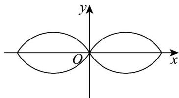
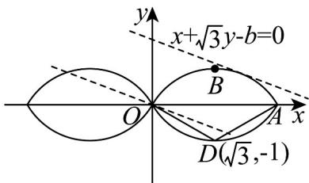
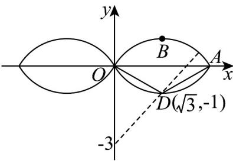

> [!faq]- 《高二数学上学期第一次月考（人教A版2019选择性必修第一册第一章_第二章，高效培优·强化卷）》官方解析
>
> > [!success]- **【答案】** AC
>
> > [!note]- **【解析】**
> > 由题意得， $D_{1}\left(0,\frac{\sqrt{3}}{2},\frac{1}{2}\right)$ ，故A正确；
> >
> > $E\left(\frac{\sqrt{3}}{2},\frac{\sqrt{3}}{2},0\right)$ ，所以 $\overrightarrow{D_{1}E}=\left(\frac{\sqrt{3}}{2},0,-\frac{1}{2}\right)$ ， $\left|\overrightarrow{D_{1}E}\right|=\sqrt{\left(\frac{\sqrt{3}}{2}\right)^{2}+0^{2}+\left(-\frac{1}{2}\right)^{2}}=1$ ，故B不正确；
> >
> > 由题意得， $B(\sqrt{3},0,0)$ ， $C(\sqrt{3},\sqrt{3},0)$ ， $B_{1}\left(\frac{\sqrt{3}}{2},0,\frac{1}{2}\right)$
> >
> > 所以 $\overrightarrow{BC}=(0,\sqrt{3},0)$ ， $\overrightarrow{BB_{1}}=\left(-\frac{\sqrt{3}}{2},0,\frac{1}{2}\right)$ ，
> >
> > 设 $m=(x,y,z)$ 是平面 $BB_{1}C_{1}C$ 的法向量，则 $\left\{\begin{aligned}&m\cdot\overrightarrow{BC}=\sqrt{3}y=0\\&\rightarrow\overrightarrow{BB_{1}}=-\frac{\sqrt{3}}{2}x+\frac{1}{2}z=0\end{aligned}\right.$
> >
> > 令 $x = 1$ ，则 $y = 0$ ， $z = \sqrt{3}$ ，则 $\stackrel{\square}{m} = (1,0,\sqrt{3})$ ，故C正确
> >
> > $\overrightarrow{D_{1}B}=\left(\sqrt{3},-\frac{\sqrt{3}}{2},-\frac{1}{2}\right)$ ，则点到平面的距离为 $\left|\frac{\overrightarrow{D_{1}B}\cdot\overrightarrow{m}}{|m|}\right|=\left|\frac{\sqrt{3}-\frac{\sqrt{3}}{2}}{\sqrt{1+3}}\right|=\frac{\sqrt{3}}{4}$ ，故D不正确.
> >
> > 故选：AC
> >
> > 11. 数学中有许多形状优美的曲线，曲线 $C: x^2 + y^2 = 2\sqrt{3} |x| - 2|y|$ 就是其中之一，其形状酷似数学符号“ $\infty$ ”
> >
> > （如图），对于此曲线，下列说法正确的是（ ）
> >
> > 
> >
> > A．曲线 C 与直线 y = x 有 3 个公共点；
> >
> > B. $x + \sqrt{3} y$ 的最大值为4
> >
> > C. 曲线 $C$ 所围成的图形的面积为 $\frac{8\pi}{3} - 2\sqrt{3}$
> >
> > D. $x^{2} + (y + 3)^{2}$ 的最大值为 $11 + 4\sqrt{7}$ .
> >
> > 【答案】ABD
> >
> > 【详解】对于 A，由 $\left\{\begin{aligned}y&=x\\ x^{2}&+y^{2}=2\sqrt{3}\left|x\right|-2\left|y\right|\end{aligned}\right.$ ，得 $2x^{2}=2\left|x\right|(\sqrt{3}-1)$ ，
> >
> > 所以 $x^{2} = |x|(\sqrt{3} - 1)$ ，即 $|x|^{2} = |x|(\sqrt{3} - 1)$
> >
> > 解得 $|x| = 0$ 或 $|x| = \sqrt{3} - 1$ ，所以 $x = 0$ 或 $x = \sqrt{3} - 1$ 或 $x = 1 - \sqrt{3}$
> >
> > 即曲线 C 与直线 y = x 有 3 个公共点，故 A 正确；
> >
> > 对于B， $x^{2} + y^{2} = 2\sqrt{3}\left|x\right| - 2\left|y\right|\Leftrightarrow \left\{ \begin{array}{ll}x^{2} + y^{2} - 2\sqrt{3} x + 2y = 0,x\quad 0,y\quad 0\\ x^{2} + y^{2} + 2\sqrt{3} x + 2y = 0,x\langle 0,y\rangle 0\\ x^{2} + y^{2} + 2\sqrt{3} x - 2y = 0,x <   0,y <   0\\ x^{2} + y^{2} - 2\sqrt{3} x - 2y = 0,x > 0,y <   0 \end{array} \right.,$
> >
> > 如图所示：
> >
> > 
> >
> > 由图可知，AB 所在圆的圆心为 $D(\sqrt{3}, -1)$ ，半径为 2， $OA = 2\sqrt{3}$ .
> >
> > 令 $b = x + \sqrt{3} y$ ，则 $x + \sqrt{3} y - b = 0$ ，即 $y = -\frac{\sqrt{3}}{3} x + \frac{\sqrt{3}}{3} b$
> >
> > 如图，当该直线与AB相切时，直线与y轴的截距最大，
> >
> > 由 $d = r$ ，得 $\frac{\left|\sqrt{3} - \sqrt{3} - b\right|}{\sqrt{1^2 + \sqrt{3}^2}} = 2$ ，解得 $b = \pm 4$ ，即 $x + \sqrt{3} y$ 的最大值为4，故B正确；
> >
> > 对于 C，由选项 B 知，曲线 C 所围成的图形的面积为四个全等弓形 OAB 的面积之和，
> >
> > 设弓形 OAB 的面积为 $S_{1}$ ，
> >
> > 在 $\triangle ADO$ 中， $\cos \angle ADO = \frac{4 + 4 - 12}{2 \times 2 \times 2} = -\frac{1}{2}, \angle ADO \in (0, \pi)$ ，
> >
> > 所以 $\angle ADO = \frac{2\pi}{3}$
> >
> > 所以扇形 ADO 的面积 $S' = \frac{1}{2} \times 2^{2} \times \frac{2\pi}{3} = \frac{4\pi}{3}$
> >
> > $S_{\triangle ADO}=\frac{1}{2}\times2\sqrt{3}\times1=\sqrt{3}$ ，所以 $S_{1}=\frac{4\pi}{3}-\sqrt{3}$
> >
> > 所以曲线 C 所围成的图形的面积为 $4S_{1}=\frac{16\pi}{3}-4\sqrt{3}$ ，故 C 错误；
> >
> > 对于D， $x^{2} + (y + 3)^{2}$ 可表示为曲线 $C$ 上的点 $(x,y)$ 与定点 $(0, - 3)$ 的距离的平方，
> >
> > 
> >
> > 由图可知，最大距离为定点 $(0, -3)$ 到圆心 $D(\sqrt{3}, -1)$ 的距离与半径之和，
> >
> > 即 $\sqrt{(0 - \sqrt{3})^2 + (-3 + 1)^2} + 2 = \sqrt{7} + 2$
> >
> > 所以 $x^{2} + (y + 3)^{2}$ 的最大值为 $(\sqrt{7} + 2)^{2} = 11 + 4\sqrt{7}$ ，故D正确.
> >
> > 故选 **ABD**
