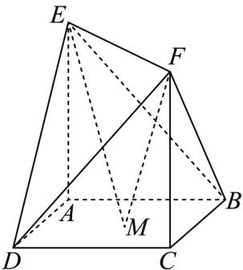

<!-- question-source:start -->
13．如图，在多面体 $ABCDEF$ 中，底面 $ABCD$ 是边长为 1 的正方形， $M$ 为底面 $ABCD$ 内的一个动点（包括

边界）， $AE \perp$ 底面 ABCD， $CF \perp$ 底面 ABCD，且 $AE = CF = 2$ ，则 $ME \cdot MF$ 的最小值与最大值的和为 \_\_\_\_

<!-- question-source:end -->

![[高中/课堂同步/题库/人教A版高中数学同步讲义(2026)/03_选择性必修第一册/月考/高二数学上学期第一次月考（人教A版2019选择性必修第一册第一章_第二章，高效培优·强化卷）/三_填空题/questions/answers/Q00079038A1.md]]
