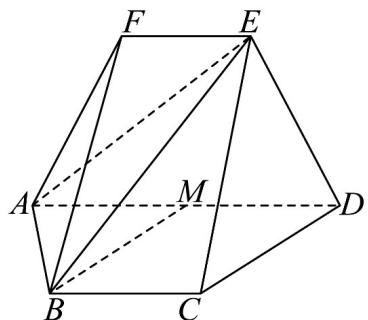

<!-- question-source:start -->
19. (17 分)

在《九章算术》中，将有三条棱相互平行且有一个面为梯形的五面体称为“羡除”。如图，五面体 $ABCDEF$

中，四边形 ABCD 与四边形 ADEF 均为等腰梯形，其中 $EF \parallel AD \parallel BC$ ，AD = 4，EF = BC = AB = 2，

$ED = \sqrt{10}$ ， $M$ 为 $AD$ 的中点，平面 $BCEF$ 与平面 $ADEF$ 交于 $EF$ ·再从条件①，条件②，条件③中选择一个

作为已知，使得羡除 $ABCDEF$ 能够唯一确定，然后解答下列各题

条件①：平面 $CDE \perp$ 平面 ABCD；

条件②：平面 ADEF ⊥ 平面 ABCD；

条件③： $EC = 2\sqrt{3}$

(1)求证： $BM / /$ 平面 $CDE$ ；

(2)求二面角 $B - AE - F$ 的余弦值；

(3)在线段 $AE$ 上是否存在点 $Q$ ，使得 $MQ$ 与平面 $ABE$ 所成角的正弦值为 7？若存在，求出 $\overline{AE}$ 的值；若

$$
\frac {\sqrt {7}}{7}
$$

不存在，请说明理由.
<!-- question-source:end -->

![[高中/课堂同步/题库/人教A版高中数学同步讲义(2026)/03_选择性必修第一册/月考/高二数学上学期第一次月考（人教A版2019选择性必修第一册第一章_第二章，高效培优·强化卷）/四_解答题/questions/answers/Q00079043A1.md]]
