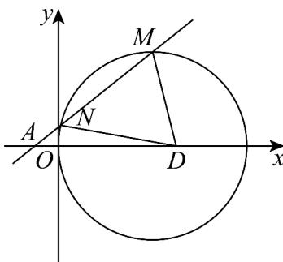

> [!faq]- 《高二数学上学期第一次月考（人教A版2019选择性必修第一册第一章_第二章，高效培优·强化卷）》官方解析
>
> > [!success]- **【答案】** (1) $(x-4)^{2}+y^{2}=16$ $(x-3)^{2}+(y-1)^{2}=10$ (2) (3) $\frac{48}{5}$ .
>
> > [!note]- **【解析】**
> > （1）设 $P(x,y)$ ，由 $\left|PA\right|^{2}+\left|PB\right|^{2}=82$ 可得 $(x+1)^{2}+y^{2}+(x-9)^{2}+y^{2}=82$
> >
> > 化简可得 $(x-4)^{2}+y^{2}=16$ ，
> >
> > 所以点 P 的轨迹 C 的方程为 $(x-4)^{2} + y^{2} = 16$
> >
> > (2) 曲线 $C$ 的方程为 $(x - 4)^{2} + y^{2} = 16$ ，即 $x^{2} + y^{2} - 8x = 0$
> >
> > 方法一：设经过两圆交点的圆系方程为 $x^{2} + y^{2} - 8x + \lambda (x^{2} + y^{2} - 8y) = 0(\lambda \neq -1)$
> >
> > 即 $x^{2} + y^{2} - \frac{8}{1 + \lambda} x - \frac{8\lambda}{1 + \lambda} y = 0$ ，所以圆心的坐标为 $\left(\frac{4}{1 + \lambda},\frac{4\lambda}{1 + \lambda}\right)$
> >
> > 又圆心在直线 $x - y - 2 = 0$ 上，所以 $\frac{4}{1 + \lambda} -\frac{4\lambda}{1 + \lambda} -2 = 0$ ，解得 $\lambda = \frac{1}{3}$
> >
> > 所以所求圆的方程为 $x^{2} + y^{2} - 6x - 2y = 0$ ，即 $(x - 3)^{2} + (y - 1)^{2} = 10$
> >
> > 方法二：圆 $(x - 4)^2 + y^2 = 16$ 的圆心为 $C(4,0)$ ，半径 $r = 4$
> >
> > 圆 $O_{2}:x^{2} + (y - 4)^{2} = 16$ 的圆心为 $O_{2}(0,4)$ ，半径 $r_2 = 4$
> >
> > 因为 $\left|O_{2}C\right|=4\sqrt{2}$ ， $\left|r-r_{2}\right|=0<\left|O_{2}C\right|<r+r_{2}=8$ ，所以两圆相交.
> >
> > 由 $\left\{ \begin{array}{l}x^{2} + y^{2} - 8y = 0\\ x^{2} + y^{2} - 8x = 0 \end{array} \right.$ ，两式相减得两圆的公共弦所在直线为 $y = x$ ：
> >
> > 由 $\left\{ \begin{array}{l} y = x \\ x^2 + y^2 - 8y = 0 \end{array} \right.$ ，解得 $\left\{ \begin{array}{l} x_1 = 0 \\ y_1 = 0 \end{array} \right.$ ， $\left\{ \begin{array}{l} x_2 = 4 \\ y_2 = 4 \end{array} \right.$ ，所以两圆的交点为 $E(0,0), F(4,4)$ 。
> >
> > 线段 EF 的垂直平分线所在直线的方程为 $y-2=-\left(x-2\right)$
> >
> > 由 $\left\{ \begin{array}{l} y - 2 = -(x - 2) \\ x - y - 2 = 0 \end{array} \right.$ ，得 $\left\{ \begin{array}{l} x = 3 \\ y = 1 \end{array} \right.$
> >
> > 所以所求圆的圆心为 $(3,1)$ ，半径为 $\sqrt{3^{2}+1^{2}}=\sqrt{10}$ ，
> >
> > 所以所求圆的方程为 $(x - 3)^2 +(y - 1)^2 = 10$
> >
> > (3) 如图，设直线 $l$ 的方程为 $x = my - 1$
> >
> > 联立 $\left\{ \begin{array}{l} (x - 4)^2 + y^2 = 16 \\ x = my - 1 \end{array} \right.$ ，消去 $x$ 并整理可得 $\left(m^2 + 1\right)y^2 - 10my + 9 = 0$
> >
> > 则 $\Delta = 100m^2 - 36(m^2 + 1) = 64m^2 - 36 > 0$ ，得 $m^2 > \frac{9}{16}$
> >
> > 
> >
> > 设 $M\left(x_{1},y_{1}\right),N\left(x_{2},y_{2}\right)$ ，则 $y_{1} + y_{2} = \frac{10m}{m^{2} + 1},y_{1}y_{2} = \frac{9}{m^{2} + 1}$
> >
> > 由弦长公式可得
> >
> > $$
> > \left| M N \right| = \sqrt {1 + m ^ {2}} \sqrt {\left(y _ {1} + y _ {2}\right) ^ {2} - 4 y _ {1} y _ {2}} = \sqrt {1 + m ^ {2}} \sqrt {\left(\frac {1 0 m}{m ^ {2} + 1}\right) ^ {2} - \frac {3 6}{m ^ {2} + 1}} = \sqrt {1 + m ^ {2}} \frac {8 \sqrt {m ^ {2} - \frac {9}{1 6}}}{m ^ {2} + 1}.
> > $$
> >
> > 又 $D(5,0)$ 到直线 $x = my - 1$ 的距离 $d = \frac{6}{\sqrt{1 + m^2}}$
> >
> > 所以 $S_{\triangle DMN} = \frac{1}{2}\left|MN\right|\cdot d = \frac{1}{2}\sqrt{1 + m^2}\frac{8\sqrt{m^2 - \frac{9}{16}}}{m^2 + 1}\cdot \frac{6}{\sqrt{1 + m^2}} = \frac{24\sqrt{m^2 - \frac{9}{16}}}{m^2 + 1}$
> >
> > 令 $t=\sqrt{m^{2}-\frac{9}{16}}>0$ ，则 $m^{2}=t^{2}+\frac{9}{16}$ ，
> >
> > 所以 $S_{\triangle DMN} = \frac{24t}{t^{2} + \frac{25}{16}} = \frac{24}{t + \frac{25}{16t}} \leq \frac{24}{2\sqrt{t \times \frac{25}{16t}}} = \frac{48}{5}$ ，当且仅当 $t = \frac{25}{16t}$ ，即 $t = \frac{5}{4}$ 时取等号，
> >
> > 所以 $\triangle DMN$ 面积的最大值为 $\frac{48}{5}$
