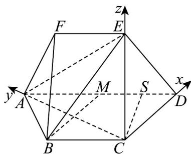
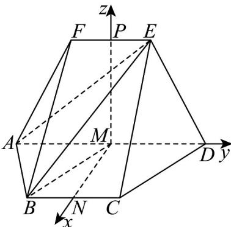
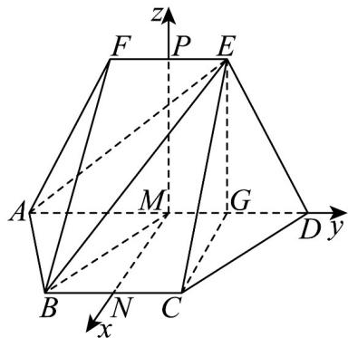

> [!faq]- 《高二数学上学期第一次月考（人教A版2019选择性必修第一册第一章_第二章，高效培优·强化卷）》官方解析
>
> > [!success]- **【答案】** (1)证明见解析 (2)答案见解析 (3)不存在，理由见解析
>
> > [!note]- **【解析】**
> > （1）选①、②或③，几何体都能唯一确定，
> >
> > 在等腰梯形 ABCD 中，M 是 AD 的中点，AD = 2BC
> >
> > 所以 $MD = BC$ ，又 $MD // BC$
> >
> > 故四边形 BCDM 为平行四边形，故 $BM \parallel CD$ ，
> >
> > 因为 $BM \notin$ 平面 $CDE$ ， $CD \subset$ 平面 $CDE$ ，故 $BM //$ 平面 $CDE$ .
> >
> > (2) 选①: 如图, 连接 $AC$ , 过 $C$ 作 $CS \perp AD$ 于 $S$
> >
> > 则 $DS = 1$ ， $AS = 3$ ， $CS = \sqrt{3}$ ， $AC = 2\sqrt{3}$ ，同理可得 $AE = 3\sqrt{2}$
> >
> > 则 $AC^{2} + CD^{2} = AD^{2}$ ，故 $AC \perp CD$ .
> >
> > 
> >
> > 因为平面 $CDE \perp$ 平面 $ABCD$ ，平面 $CDE \cap$ 平面 $ABCD = CD$ ， $AC \subset$ 平面 $ABCD$
> >
> > 故 $AC \perp$ 平面 $CDE$ ，又 $EC \subset$ 平面 $CDE$ ，故 $AC \perp EC$
> >
> > 故 $EC = \sqrt{AE^{2} - AC^{2}} = \sqrt{6}$ ，此时 $ED^{2} = EC^{2} + DC^{2}$ ，故 $EC \perp DC$
> >
> > 以 $C$ 为坐标原点， $CD, CA, CE$ 所在直线分别为 $x, y, z$ 轴建立空间直角坐标系，
> >
> > $$
> > \text {则} A \left(0, 2 \sqrt {3}, 0\right), B \left(- 1, \sqrt {3}, 0\right), E \left(0, 0, \sqrt {6}\right), F \left(- 1, \sqrt {3}, \sqrt {6}\right)
> > $$
> >
> > $$
> > \stackrel {{\text {UUU}}} {{A B}} = \left(- 1, - \sqrt {3}, 0\right) \quad \stackrel {{\text {UUU}}} {{A E}} = \left(0, - 2 \sqrt {3}, \sqrt {6}\right) \quad \stackrel {{\text {UUU}}} {{A F}} = \left(- 1, - \sqrt {3}, \sqrt {6}\right) \quad \stackrel {{\text {UUU}}} {{F E}} = \left(1, - \sqrt {3}, 0\right).
> > $$
> >
> > 设平面 $BAE$ 的法向量为 $p = (a,b,c)$ ，则 $\left\{ \begin{array}{l} p \cdot AB = -a - \sqrt{3}b = 0, \\ p \cdot AE = -2\sqrt{3}b + \sqrt{6}c = 0, \end{array} \right.$
> >
> > 取 $c = 1$ ，则 $\vec{p} = \left(-\frac{\sqrt{6}}{2},\frac{\sqrt{2}}{2},1\right)$
> >
> > 设平面 $AEF$ 的法向量为 $q = (x,y,z)$ ，则 $\left\{ \begin{array}{l} q \cdot AF = x - \sqrt{3}y + \sqrt{6}z = 0, \\ q \cdot FE = x - \sqrt{3}y = 0, \end{array} \right.$
> >
> > 取 $y = 1$ ，则 $q = (\sqrt{3}, 1, \sqrt{2})$
> >
> > $$
> > \stackrel {\rightarrow} {p \cdot q} = \left(- \frac {\sqrt {6}}{2}, \frac {\sqrt {2}}{2}, 1\right) \cdot (\sqrt {3}, 1, \sqrt {2}) = - \frac {3 \sqrt {2}}{2} + \frac {\sqrt {2}}{2} + \sqrt {2} = 0
> > $$
> >
> > 所以二面角 B-AE-F 的余弦值为 0.
> >
> > 选②：取 BC 的中点为 N, EF 的中点为 P，连接 MP, MN，如图，
> >
> > 
> >
> > 因为四边形 ABCD, ADEF 均为等腰梯形， $EF \parallel AD \parallel BC$ ，所以 $PM \perp AD$ ， $MN \perp AD$ 。
> >
> > 因为平面 $ADEF \perp$ 平面 $ABCD$ ，平面 $ADEF \cap$ 平面 $ABCD = AD$
> >
> > $PM \perp AD$ ， $PM \subset$ 平面 ADEF，故 $PM \perp$ 平面 ABCD
> >
> > 又 $MN \subset$ 平面ABCD，所以 $PM \perp MN$ .
> >
> > 以 $M$ 为坐标原点， $MN, MD, MP$ 所在直线分别为 $x, y, z$ 轴建立空间直角坐标系，
> >
> > 则 $A(0, -2, 0)$ ， $B(\sqrt{3}, -1, 0)$ ， $E(0, 1, 3)$ ， $\overline{BA} = (-\sqrt{3}, -1, 0)$ ， $\overline{AE} = (0, 3, 3)$ 。
> >
> > 设平面 $BAE$ 的法向量为 $n = (x,y,z)$ ，则 $\left\{ \begin{array}{l} n \cdot BA = 0, \\ n \cdot AE = 0, \end{array} \right.$ 即 $\left\{ \begin{array}{l} -\sqrt{3} x - y = 0, \\ 3y + 3z = 0, \end{array} \right.$
> >
> > 令 $x = \sqrt{3}$ ，则 $y = -3, z = 3$ ，则 $n = (\sqrt{3}, -3, 3)$ 易知 $m = (-1, 0, 0)$ 是平面 $AEF$ 的一个法向量.
> >
> > $\cos m, n = \frac{m \cdot n}{|m||n|} = \frac{-\sqrt{3}}{1 \times \sqrt{3 + 9 + 9}} = -\frac{\sqrt{7}}{7}$ ，根据图形知二面角 $B - AE - F$ 为钝角，
> >
> > 所以二面角 B-AE-F 的余弦值为 $-\frac{\sqrt{7}}{7}$
> >
> > 选③：取 BC 的中点为 N, EF 的中点为 P，连接 MP, MN，则 $MP \perp AD$ ， $MN \perp AD$ 。
> >
> > 取 MD 的中点为 G ，连接 CG, EG ，如图·易知 $EG \perp AD$ ， $CG \perp AD$ ，
> >
> > 
> >
> > $$
> > G D = 1 \quad E G = \sqrt {E D ^ {2} - G D ^ {2}} = 3 \quad C G = \sqrt {C D ^ {2} - G D ^ {2}} = \sqrt {3}
> > $$
> >
> > 又 $EC = 2\sqrt{3}$ ，所以 $EC^{2} = EG^{2} + CG^{2}$ ，故 $EG \perp CG$ ，
> >
> > 故二面角 $E - AD - C$ 的大小为 $\frac{\pi}{2}$ ，所以 $PM \perp MN$ .
> >
> > 下同②.
> >
> > (3) 选①：
> >
> > 设 $\frac{AQ}{AE} = \lambda$ ， $\lambda \in [0,1]$ ，则 $A\overline{Q} = \lambda \overline{AE} = (0, - 2\sqrt{3}\lambda ,\sqrt{6}\lambda)$ ， $M(1,\sqrt{3},0)$ ，则 $MA = (-1,\sqrt{3},0)$
> >
> > 所以 $\overline{MQ} = \overline{MA} + \overline{AQ} = (-1, -2\sqrt{3}\lambda + \sqrt{3}, \sqrt{6}\lambda)$
> >
> > $$
> > \left| \cos M Q, p \right| = \frac {\left| M Q \cdot p \right|}{\left| M Q \right| \cdot | p |} = \frac {\sqrt {6}}{\sqrt {3} \times \sqrt {1 ^ {2} + (- 2 \sqrt {3} \lambda + \sqrt {3}) ^ {2} + (\sqrt {6} \lambda) ^ {2}}} = \frac {\sqrt {7}}{7},
> > $$
> >
> > 解得 $\lambda=\frac{1\pm\sqrt{6}}{3}$ ，均不满足题意，故不存在点 Q 满足题意.
> >
> > 选②或③：
> >
> > 设 $\frac{AQ}{AE} = \lambda$ ， $\lambda \in [0,1]$ ，则 $AQ = \lambda AE = (0,3\lambda ,3\lambda)$
> >
> > $M(0,0,0)$ ，则 $\overline{MA} = (0, - 2,0)$ ，所以 $\overline{MQ} = \overline{MA} +\overline{AQ} = (0,3\lambda -2,3\lambda)$
> >
> > $$
> > \left| \cos M Q, n \right| = \frac {\left| \stackrel {\square \square \square} {M Q} \cdot n \right|}{\left| M Q \right| \cdot | n |} = \frac {6}{\sqrt {2 1} \times \sqrt {(3 \lambda - 2) ^ {2} + (3 \lambda) ^ {2}}} = \frac {\sqrt {7}}{7}, \text {解得} \lambda = \frac {1 \pm \sqrt {5}}{3}
> > $$
> >
> > 均不满足题意，故不存在点 Q 满足题意.
