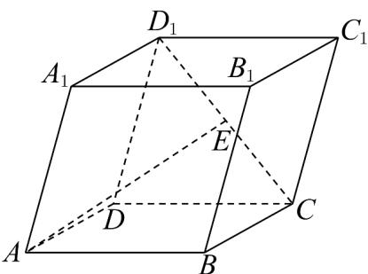
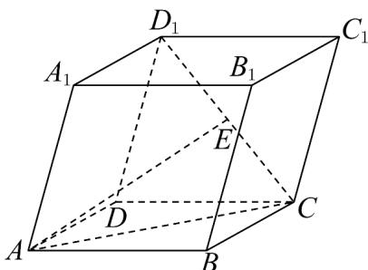

> [!faq]- 《高二数学上学期第三次月考（人教A版2019选择性必修第一册全部+选择性必修第二册第四章（数列），高效培优·提升卷）》官方解析
>
> > [!success]- **【答案】**  A. $AE = \frac{1}{2}a + b + \frac{1}{2}c$ C. $AE = \frac{3}{2}a + b + \frac{1}{2}c$ B. $AE = \frac{3}{2}a + b - \frac{1}{2}c$ $$ A E = \frac {1}{2} a + b - \frac {3}{2} c $$
>
> > [!note]- **【解析】**
> > 在平行六面体 $ABCD - A_{1}B_{1}C_{1}D_{1}$ 中，
> >
> > 连接 AC，如图所示：
> >
> > 
> >
> > 因为点 $E$ 为 $CD_{1}$ 的中点， $\overline{AB} = a, \overline{AD} = b, \overline{AA}_{1} = c$
> >
> > 所以 $AE = AC + CE = AB + AD + \frac{1}{2} CD_{1}$
> >
> > $$
> > = A B + A D + \frac {1}{2} \left(C C _ {1} + C D\right)
> > $$
> >
> > $$
> > = A B + A D + \frac {1}{2} A A _ {1} + \frac {1}{2} B A
> > $$
> >
> > $= \overline{AB} + \overline{AD} + \frac{1}{2} \overline{AA}_{1} - \frac{1}{2} AB$ $= \frac{1}{2} AB + \overline{AD} + \frac{1}{2} AA_{1}$ $= \frac{1}{2} a + b + \frac{1}{2} c$
> >
> > 故选：A.
> >
> > ## 7. 德国大数学家高斯，被誉为数学界的王子，在其年幼时，对 $1 + 2 + 3 + \mathrm{L} + 100$ 的求和运算中，提出了倒
> >
> > ## 序相加法的原理，该原理基于所给数据前后对应项的和呈现一定的规律性，因此，此方法也称之为高斯算
> >
> > 法．现有函数 $f(x)=\frac{2x}{3k+6078}$ （k>0），则 $f(1)+f(2)+f(3)+\cdots+f(k+2025)$ 等于（）
> > A. $\frac{k+2025}{3}$ B. $\frac{2k+6078}{3}$ C. $\frac{2k+6078}{6}$ D. $\frac{k+2025}{6}$
> >
> > 【答案】A
> >
> > 【详解】由题意得 $f(x)=\frac{2x}{3k+6078}$ ，设 $m=k+2026$ ，
> >
> > $$
> > f (x) + f (m - x) = \frac {2 x}{3 m} + \frac {2 (m - x)}{3 m} = \frac {2 x}{3 m} + \frac {2 m - 2 x}{3 m} = \frac {2}{3}
> > $$
> >
> > 设 $S = f(1) + f(2) + f(3) + \cdots + f(k + 2025)$
> >
> > 倒序得 $S = f(k + 2025) + f(k + 2024) + \cdots + f(2) + f(1)$
> >
> > 两式相加得到 $2S=(k+2025)\times\frac{2}{3}=\frac{2(k+2025)}{3}$ ，解得 $S=\frac{k+2025}{3}$ ，故只有 A 正确.
> >
> > 故选 **A**
