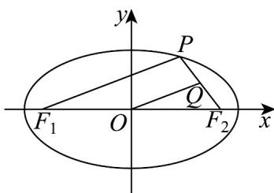

> [!faq]- 《高二数学上学期第三次月考（人教A版2019选择性必修第一册全部+选择性必修第二册第四章（数列），高效培优·提升卷）》官方解析
>
> > [!success]- **【答案】** B
>
> > [!note]- **【解析】**
> > 因为 $Q$ 为 $PF_{2}$ 的中点，而 $O$ 是 $F_{1}F_{2}$ 中点，所以 $\left|OQ\right| = \frac{1}{2}\left|PF_{1}\right|$
> >
> > 
> >
> > 所以 $\triangle QOF_{2}$ 的周长是 $\triangle PF_{1}F_{2}$ 周长的一半，
> >
> > 又 $\triangle QOF_{2}$ 的周长为6，所以 $\Delta PF_{1}F_{2}$ 周长是12，
> >
> > 即 $\left|PF_{1}\right|+\left|PF_{2}\right|+\left|F_{1}F_{2}\right|=2a+2c=12$ ，得 $a+c=6$
> >
> > 又 a = 4 ，所以 c = 2 ， $e = \frac{c}{a} = \frac{1}{2}$
> >
> > 故选：B.
> >
> > ## 二、选择题：本题共3小题，每小题6分，共18分．在每小题给出的选项中，有多项符合题目要求．全部选对的得6分，部分选对的得部分分，有选错的得0分.
