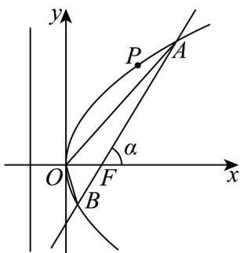

> [!faq]- 《高二数学上学期第三次月考（人教A版2019选择性必修第一册全部+选择性必修第二册第四章（数列），高效培优·提升卷）》官方解析
>
> > [!success]- **【答案】** 8
>
> > [!note]- **【解析】**
> > 由已知得 $x_{P} + \frac{p}{2} = 2 + \frac{p}{2} = 3$ ，则 $p = 2$ ，所以抛物线方程为 $y^{2} = 4x$
> >
> > 设直线 AB 的倾斜角为 $\alpha$ ，
> >
> > 由于直线 AB 过焦点 F， $S_{\triangle OAB} = \frac{p^{2}}{2\sin\alpha} = \frac{4}{2\sin\alpha} = 2\sqrt{2} \Rightarrow \sin\alpha = \frac{\sqrt{2}}{2}$
> >
> > 又 $\frac{1}{|AF|} +\frac{1}{|BF|} = \frac{2}{p} = 1$ ，所以 $\left|AF\right|\left|BF\right| = \left|AF\right| + \left|BF\right| = \left|AB\right| = \frac{2p}{\sin^2\alpha} = \frac{4}{\frac{1}{2}} = 8.$
> >
> > 故答案为：8.
> >
> > 
