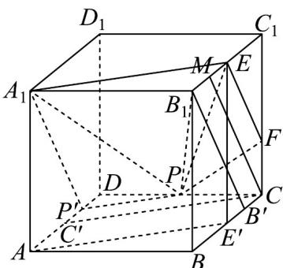
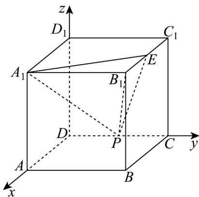

> [!faq]- 《高二数学上学期第三次月考（人教A版2019选择性必修第一册全部+选择性必修第二册第四章（数列），高效培优·提升卷）》官方解析
>
> > [!success]- **【答案】** ①②
>
> > [!note]- **【解析】**
> > - **对于①**：由 $AA_{1}\perp$ 平面ABCD, $AP\subset$ 平面ABCD，得 $AA_{1}\perp AP$ ，同理 $PC\perp EC$
> >
> > 若 $P$ 在线段 $CD$ 上，设 $DP = m$
> >
> > 所以 $PA_{1}^{2} = AA_{1}^{2} + AD^{2} + DP^{2} = 8 + m^{2}$
> >
> > 又 $PE^{2} = PC^{2} + CC_{1}^{2} + C_{1}E^{2} = 4 + (2 - m)^{2} + 1 = 5 + (2 - m)^{2}$
> >
> > 由 $8+m^{2}=5+(2-m)^{2}$ 得 $m=\frac{1}{4}$ ，存在唯一点P使得 $PA_{1}=PE$ ；
> >
> > 若 P 在直线 CD 上，且在 D 点左侧，设 DP = m，则 $CP = 2 + m$ ，
> >
> > 所以 $PA_{1}^{2} = AA_{1}^{2} + AD^{2} + DP^{2} = 8 + m^{2}$
> >
> > 又 $PE^{2} = PC^{2} + CC_{1}^{2} + C_{1}E^{2} = 4 + (2 + m)^{2} + 1 = 5 + (2 + m)^{2}$
> >
> > 由 $8 + m^2 = 5 + (2 + m)^2$ ，得 $m = -\frac{1}{4}$ ，舍去；
> >
> > 若 $P$ 在直线 $CD$ 上，且在 $C$ 点右侧，设 $DP = m$ ，则 $CP = m - 2$
> >
> > 所以 $PA_{1}^{2}=AA_{1}^{2}+AD^{2}+DP^{2}=8+m^{2}$
> >
> > 又 $PE^{2} = PC^{2} + CC_{1}^{2} + C_{1}E^{2} = 4 + (m - 2)^{2} + 1 = 5 + (m - 2)^{2}$
> >
> > 由 $8+m^{2}=5+(m-2)^{2}$ ，得 $m=\frac{1}{4}$ ，舍去，①正确；
> > - **对于②**：正方体中， $CD \parallel$ 平面 $A_{1}B_{1}C_{1}D_{1}, P \in CD$ ，所以 P 到平面 $A_{1}B_{1}C_{1}D_{1}$ 的距离不变，
> >
> > 即 P 到平面 $A_{1}B_{1}E$ 的距离不变，而 $\triangle A_{1}B_{1}E$ 面积不变，
> >
> > 因此三棱锥 $P-A_{1}B_{1}E$ ，即四面体 $A_{1}-PB_{1}E$ 的体积不变，②正确；
> >
> > 
> > - **对于③**：过 E 作 $EE' \perp$ 平面 ABCD，则 $E'$ 为 BC 中点，连接 $AE'$ ，则 $A_{1}E \parallel AE'$
> >
> > 过 C 作 $CC' \parallel AE'$ ，则 $C'$ 为 AD 中点，过 P 作 $PP' \parallel CC'$ ，则 $A_{1}E \parallel PP'$ ，
> >
> > 连接 $A_{1}P'$ ，则 $A_{1}P' \subset$ 平面 $PA_{1}E$ ；
> >
> > 过 $B_{1}$ 作 $B_{1}B^{\prime} \parallel A_{1}P^{\prime}$ ，则 $B^{\prime}$ 为 $E^{\prime}C$ 中点，
> >
> > 过 $C$ 作 $CM \parallel B_{1}B'$ ，则 $M$ 为 $B_{1}E$ 中点，
> >
> > 过 $E$ 作 $EF \parallel MC$ ，则 $F$ 是靠近 $C$ 的三等分点，
> >
> > 所以 $EF \parallel A_{1}P'$ ，连接 PF，
> >
> > 则五边形 $A_{1}P'PFE$ 是平面 $PA_{1}E$ 截正方体 $ABCD-A_{1}B_{1}C_{1}D_{1}$ 所得，③错误；
> > - **对于④**：以 $DA, DC, DD_{1}$ 所在直线为 $x, y, z$ 轴建立空间直角坐标系，如下图，
> >
> > 
> >
> > 正方体棱长为2，则 $A_{1}(2,0,2),E(1,2,2),B_{1}(2,2,2)$
> >
> > 设 $P(0,m,0)$
> >
> > 则 $PE = (1,2 - m,2)$ ， $PE = \sqrt{1 + (m - 2)^2 + 4} = \sqrt{m^2 - 4m + 9}$
> >
> > 又 $A_{1}E = (-1,2,0)$ ， $\left|A_1E\right| = \sqrt{5}$
> >
> > 所以 $\cos\left\langle\overrightarrow{PE},\overrightarrow{A_{1}E}\right\rangle=\frac{(1,2-m,2)\cdot(-1,2,0)}{\sqrt{5}\cdot\sqrt{m^{2}-4m+9}}=\frac{3-2m}{\sqrt{5}\cdot\sqrt{m^{2}-4m+9}}$
> >
> > 设 P 到直线 $A_{1}E$ 的距离为 d ，
> >
> > 则 $d = \left|\overrightarrow{PE}\right|\sin \left\langle \overrightarrow{PE},\overrightarrow{A_1E}\right\rangle = \sqrt{m^2 - 4m + 9}\cdot \sqrt{1 - \left(\frac{3 - 2m}{\sqrt{5}\cdot\sqrt{m^2 - 4m + 9}}\right)^2}$
> >
> > $$
> > = \frac {\sqrt {m ^ {2} - 8 m + 3 6}}{\sqrt {5}} = \frac {\sqrt {(m - 4) ^ {2} + 2 0}}{\sqrt {5}}
> > $$
> >
> > 若 $P$ 在线段 $CD$ 上，则 $0 \leq m \leq 2$
> >
> > 由二次函数性质知 $0 \leq m \leq 2$ 时， $y = (m - 4)^{2} + 20$ 递减，
> >
> > 所以 $d_{\min}=\frac{\sqrt{(2-4)^{2}+20}}{\sqrt{5}}=\frac{2\sqrt{30}}{5}$ ，又 $A_{1}E=\sqrt{5}$ 不变，
> >
> > 所以！ $A_{1}PE$ 的面积最小为 $\frac{1}{2}\left|A_{1}E\right|d_{\min}=\sqrt{6}$ ；
> >
> > 若 P 直线 CD 上，且在 D 左侧，则 m < 0 ，
> >
> > 由二次函数性质知， $m < 0$ 时， $y = (m - 4)^2 + 20$ 无最小值；
> >
> > 若 P 直线 CD 上，且在 C 右侧，则 m > 2 ，
> >
> > 由二次函数性质知， $m > 2$ 时， $y = (m - 4)^2 +20$ 在 $m = 4$ 时，取得最小，
> >
> > 且此时 $d=\frac{\sqrt{20}}{\sqrt{5}}=2$ ，又 $A_{1}E=\sqrt{5}$ 不变，
> >
> > 所以！ $A_{1}PE$ 的面积最小为 $\frac{1}{2}\left|A_{1}E\right|d=\sqrt{5}$ ，④错误；
> >
> > 故答案为：①②.
> >
> > 四、解答题：本题共5小题，共77分。解答应写出文字说明、证明过程或演算步骤。
