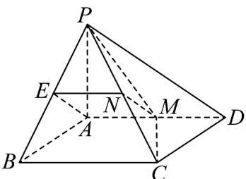
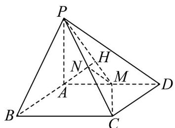
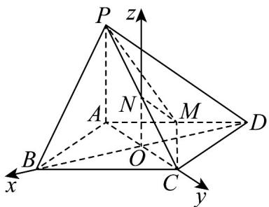

> [!faq]- 《高二数学上学期第三次月考（人教A版2019选择性必修第一册全部+选择性必修第二册第四章（数列），高效培优·提升卷）》官方解析
>
> > [!success]- **【答案】** (1)证明见解析(2)证明见解析(3) $2\sqrt{3}$
>
> > [!note]- **【解析】**
> > （1）取 $PB$ 的中点 $E$ ，连接 $EA, EN$
> >
> > 
> >
> > 在 $\triangle PBC$ 中， $EN // BC$ 且 $EN = \frac{1}{2} BC$ ，又 $AM = \frac{1}{2} AD$ ， $AD // BC, AD = BC$ ，
> >
> > 所以 $EN / / AM$ ， $EN = AM$ ，所以四边形 $ENMA$ 是平行四边形，
> >
> > 所以 $MN \parallel AE$ 。又 $MN \notin$ 平面 $PAB$ ， $AE \subset$ 平面 $PAB$ ，
> >
> > 所以 $MN / /$ 平面 $PAB$ .
> >
> > (2) 过点 A 作 PM 的垂线，垂足为 H，
> >
> > 
> >
> > 因为平面 $PMC \perp$ 平面 $PAD$ ，平面 $PMC \cap$ 平面 $PAD = PM$ ， $AH \perp PM$ ， $AH \subset$ 平面 $PAD$
> >
> > 所以 $AH \perp$ 平面 PMC，又 $CM \subset$ 平面 PMC，所以 $AH \perp CM$
> >
> > 因为 $PA \perp$ 平面 ABCD ，CM $\subset$ 平面 ABCD ，所以 $PA \perp CM$ 。
> >
> > 因为 $PA \cap AH = A$ ， $PA \subset$ 平面 PAD， $AH \subset$ 平面 PAD，
> >
> > 所以 CM ⊥ 平面 PAD．又 AD ⊂ 平面 PAD，所以 CM ⊥ AD．
> >
> > (3) 设 $AC \cap BD = O$ ，过 $O$ 点作 $OZ \perp ABCD$ ，以 $O$ 点为坐标原点， $OB, OC, OZ$ 为坐标轴建立空间直角坐
> >
> > 标系，
> >
> > 因为 $CM \perp AD$ ， $M$ 为 $AD$ 的中点，所以 $AC = CD = 2$
> >
> > 设 $PA = a$ ， $BD^{2} = AB^{2} + AD^{2} - 2AB\cdot AD\cos 120^{\circ} = 12$ ，所以 $BD = 2\sqrt{3}$
> >
> > $$
> > P (0, - 1, a), B (\sqrt {3}, 0, 0), C (0, 1, 0), D (- \sqrt {3}, 0, 0), \stackrel {{\text {UUU}}} {{P C}} = (0, 2, - a), \stackrel {{\text {UUU}}} {{B C}} = (- \sqrt {3}, 1, 0), \stackrel {{\text {UUU}}} {{C D}} = (- \sqrt {3}, - 1, 0)
> > $$
> >
> > 设平面 $PBC$ 的法向量 $\vec{\square} n_{1} = (x_{1},y_{1},z_{1})\Rightarrow \left\{ \begin{array}{ll}\overline{n}_{1}\cdot \overline{PC} = 0\\ \overline{n}_{1}\cdot BC = 0 \end{array} \right.\Rightarrow \left\{ \begin{array}{ll}2y_{1} - az_{1} = 0\\ -\sqrt{3} x_{1} + y_{1} = 0 \end{array} \right.,$
> >
> > 取 $y_{1}=\sqrt{3}a\Rightarrow x_{1}=a,z_{1}=2\sqrt{3}\Rightarrow n_{1}^{\square}=\left(a,\sqrt{3}a,2\sqrt{3}\right)$ ;
> >
> > 同理设平面 $PCD$ 的法向量 $\vec{n}_2 = (x_2, y_2, z_2) \Rightarrow \begin{cases} n_* \cdot PC = 0 \\ n_2 \cdot CD = 0 \end{cases} \Rightarrow \begin{cases} 2y_2 - az_2 = 0 \\ -\sqrt{3}x_2 - y_2 = 0 \end{cases}$
> >
> > $$
> > y _ {2} = \sqrt {3} a \Rightarrow x _ {2} = - a, z _ {2} = 2 \sqrt {3} \Rightarrow n _ {2} ^ {\text {山}} = (- a, \sqrt {3} a, 2 \sqrt {3})
> > $$
> >
> > 设平面 与平面 的夹角为 $\theta, \cos \theta = \left|\cos n_1, n_2\right| = \left|\frac{n_1 \cdot n_2}{n_1 \left|\left|n_2\right|\right|} = \left|\frac{-a^2 + 3a^2 + 12}{a^2 + 3a^2 + 12}\right| = \frac{5}{8}$
> >
> > $$
> > \text {所以} a ^ {2} = 9 (a > 0) \Rightarrow a = 3, S _ {A B C D} = \frac {1}{2} A C \times B D = \frac {1}{2} \times 2 \times 2 \sqrt {3} = 2 \sqrt {3}
> > $$
> >
> > $$
> > V _ {P - A B C D} = \frac {1}{3} S _ {A B C D} h = \frac {1}{3} \times 3 \times 2 \sqrt {3} = 2 \sqrt {3}.
> > $$
> >
> > 
