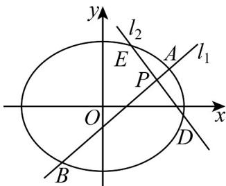

> [!faq]- 《高二数学上学期第三次月考（人教A版2019选择性必修第一册全部+选择性必修第二册第四章（数列），高效培优·提升卷）》官方解析
>
> > [!success]- **【答案】** (1) $\frac{x^{2}}{9}+\frac{y^{2}}{6}=1$ ; (2)(i)证明见解析，(ii)证明见解析.
>
> > [!note]- **【解析】**
> > （1）因为 $C$ 的离心率为 $\frac{\sqrt{3}}{3}$ ，所以 $a = \sqrt{3} c$
> >
> > 因为一个焦点与 $C$ 上的点之间的距离的最大值为 $a + c$
> >
> > 所以 $a + c = \sqrt{3} c + c = 3 + \sqrt{3}$
> >
> > 解得 $c = \sqrt{3}, a = 3$
> >
> > 所以 $b^{2}=a^{2}-c^{2}=6$
> >
> > 所以椭圆 C 的方程为 $\frac{x^{2}}{9} + \frac{y^{2}}{6} = 1$ ;
> >
> > (2) (i) 设 $A(x_{1}, y_{1}), B(x_{2}, y_{2}), D(x_{3}, y_{3}), E(x_{4}, y_{4})$ ，直线 $l_{1}$ 的方程为 $y = k(x - 2) + 1$
> >
> > 则直线 $l_{2}$ 的方程为 $y = -k(x - 2) + 1$
> >
> > 
> >
> > 由 $\left\{ \begin{array}{l} \frac{x^2}{9} + \frac{y^2}{6} = 1 \\ y = k(x - 2) + 1 \end{array} \right.$ ，消去 $y$ 并整理得 $\left(3k^2 + 2\right)x^2 - \left(12k^2 - 6k\right)x + 12k^2 - 12k - 15 = 0$ ，
> >
> > 所以 $x_{1}+x_{2}=\frac{12k^{2}-6k}{3k^{2}+2},x_{1}x_{2}=\frac{12k^{2}-12k-15}{3k^{2}+2}$
> >
> > 则 $\left|PA\right|\cdot\left|PB\right|=\sqrt{1+k^{2}}\left|x_{1}-2\right|\cdot\sqrt{1+k^{2}}\left|x_{2}-2\right|=-\left(1+k^{2}\right)\left(x_{1}-2\right)\left(x_{2}-2\right)$
> >
> > $$
> > = - \left(1 + k ^ {2}\right) \left[ x _ {1} x _ {2} - 2 \left(x _ {1} + x _ {2}\right) + 4 \right] = - \left(1 + k ^ {2}\right) \left(\frac {1 2 k ^ {2} - 1 2 k - 1 5}{3 k ^ {2} + 2} - 2 \times \frac {1 2 k ^ {2} - 6 k}{3 k ^ {2} + 2} + 4\right)
> > $$
> >
> > $$
> > = - \frac {1 + k ^ {2}}{3 k ^ {2} + 2} (1 2 k ^ {2} - 1 2 k - 1 5 - 2 4 k ^ {2} + 1 2 k + 1 2 k ^ {2} + 8) = \frac {7 (1 + k ^ {2})}{3 k ^ {2} + 2},
> > $$
> >
> > 同理可得 $\left|PD\right|\cdot\left|PE\right|=\frac{7\left(1+\left(-k\right)^{2}\right)}{3\left(-k\right)^{2}+2}=\frac{7\left(1+k^{2}\right)}{3k^{2}+2}$ ，所以 $\left|PA\right|\cdot\left|PB\right|=\left|PD\right|\cdot\left|PE\right|$ ；
> >
> > (ii) 由 (i) 知，直线 AD 的斜率 $k_{AD} = \frac{y_{1} - y_{3}}{x_{1} - x_{3}} = \frac{(kx_{1} - 2k + 1) - (-kx_{3} + 2k + 1)}{x_{1} - x_{3}} = k \cdot \frac{x_{1} + x_{3} - 4}{x_{1} - x_{3}}$
> >
> > 同理可得，直线 BE 的斜率
> >
> > $$
> > k _ {B E} = k \cdot \frac {x _ {2} + x _ {4} - 4}{x _ {2} - x _ {4}}
> > $$
> >
> > $$
> > k _ {A D} + k _ {B E} = 0
> > $$
> >
> > $$
> > \frac {x _ {1} + x _ {3} - 4}{x _ {1} - x _ {3}} + \frac {x _ {2} + x _ {4} - 4}{x _ {2} - x _ {4}} = 0
> > $$
> >
> > 只需证 $\left(x_{1} + x_{3} - 4\right)\left(x_{2} - x_{4}\right) + \left(x_{2} + x_{4} - 4\right)\left(x_{1} - x_{3}\right) = 0$
> >
> > 只需证 $x_{1}x_{2}-x_{3}x_{4}-2\left(x_{1}+x_{2}\right)+2\left(x_{3}+x_{4}\right)=0$ . (\*)
> >
> > 由 $(i)$ 知
> >
> > $$
> > x _ {1} x _ {2} - x _ {3} x _ {4} - 2 \left(x _ {1} + x _ {2}\right) + 2 \left(x _ {3} + x _ {4}\right) = \frac {1 2 k ^ {2} - 1 2 k - 1 5}{3 k ^ {2} + 2} - \frac {1 2 k ^ {2} + 1 2 k - 1 5}{3 k ^ {2} + 2} - 2 \times \frac {1 2 k ^ {2} - 6 k}{3 k ^ {2} + 2} + 2 \times \frac {1 2 k ^ {2} + 6 k}{3 k ^ {2} + 2} = \frac {- 2 4 k}{3 k ^ {2} + 2} + 2 \times \frac {1 2 k}{3 k ^ {2} + 2} = 0
> > $$
> >
> > 故（ $*$ ）式得证，所以直线 $AD$ 和 $BE$ 的斜率互为相反数.
