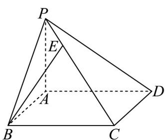

> [!faq]- 《高二数学上学期第三次月考（人教A版2019选择性必修第一册全部，高效培优·强化卷）》官方解析
>
> > [!success]- **【答案】** B
>
> > [!note]- **【解析】**
> > 因为点 $P(a - 1, a, a + 2)$ 在平面 $yOz$ 内，所以 $a - 1 = 0, a = 1$ ，即 $P(0, 1, 3)$ ，所以 $\left|OP\right| = \sqrt{0^2 + 1^2 + 3^2} = \sqrt{10}$
> >
> > 故选：B.
> >
> > 7. 我国古代数学名著《九章算术》中，将底面为矩形且一侧棱垂直于底面的四棱锥称为阳马。如图所示，已知四棱锥 $P - ABCD$ 是阳马， $PA \perp$ 平面 $ABCD$ ，且 $PE = \frac{1}{4} PC$ ，若 $AB = a, \overline{AD} = b, \overline{AP} = c$ ，则 $\overline{BE} = ($
> >
> > 
> >
> > $$
> > - \frac {5}{4} a - \frac {1}{4} b + \frac {5}{4} c
> > $$
> >
> > $$
> > \frac {5}{4} \stackrel {\rightarrow} {a} + \frac {1}{4} \stackrel {\rightharpoonup} {b} - \frac {5}{4} c
> > $$
> >
> > C. $\frac{3}{4} a - \frac{1}{4} b - \frac{3}{4} c$ D. $-\frac{3}{4} a + \frac{1}{4} b + \frac{3}{4} c$
> >
> > 【答案】D
> >
> > 【详解】 $\overline{BE}=\overline{BP}+\overline{PE}=\overline{AP}-\overline{AB}+\frac{1}{4}\overline{PC}=\overline{AP}-\overline{AB}+\frac{1}{4}\left(\overline{AC}-\overline{AP}\right)=\overline{AP}-\overline{AB}+\frac{1}{4}\left(\overline{AB}+\overline{AD}-\overline{AP}\right)$ $=c-a+\frac{1}{4}(a+b-c)=-\frac{3}{4}a+\frac{1}{4}b+\frac{3}{4}c.$
> >
> > 故选 **D**
