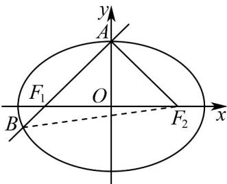

> [!faq]- 《高二数学上学期第三次月考（人教A版2019选择性必修第一册全部，高效培优·强化卷）》官方解析
>
> > [!success]- **【答案】** A
>
> > [!note]- **【解析】**
> > 设点 $A$ 在 $x$ 轴上方，如图，连接 $BF_{2}$
> >
> > 由椭圆的定义可知 $\left|AF_{1}\right|+\left|AF_{2}\right|=2a$ ， $\left|BF_{1}\right|+\left|BF_{2}\right|=2a$ 。
> >
> > 因为 $\left|AF_2\right| = 2a - 3\left|BF_1\right|$ ，所以 $\left|AF_1\right| = 3\left|BF_1\right|$
> >
> > 设 $\left|BF_{1}\right|=x(x>0)$ ，则 $\left|AF_{1}\right|=3x$ ， $\left|AB\right|=4x$ ， $\left|BF_{2}\right|=2a-x$ ， $\left|AF_{2}\right|=2a-3x$
> >
> > 又因为 $AB \perp AF_{2}$ ，所以 $\left|AB\right|^2 + \left|AF_{2}\right|^2 = \left|BF_{2}\right|^2$ ，即 $(4x)^2 + (2a - 3x)^2 = (2a - x)^2$
> >
> > 化简整理得 $a = 3x$ ，则 $\left|AF_1\right| = \left|AF_2\right| = a$ ， $A$ 与 $C$ 的上顶点重合， $\triangle AF_1F_2$ 是等腰直角三角形， $\angle AF_2F_1 = 45^\circ$
> >
> > 所以离心率 $e = \frac{|OF_2|}{|AF_2|} = \cos 45^\circ = \frac{\sqrt{2}}{2}$
> >
> > 故选：A.
> >
> > 
> >
> > ## 二、选择题：本题共3小题，每小题6分，共18分．在每小题给出的选项中，有多项符合题目要求．全部选对的得6分，部分选对的得部分分，有选错的得0分.
