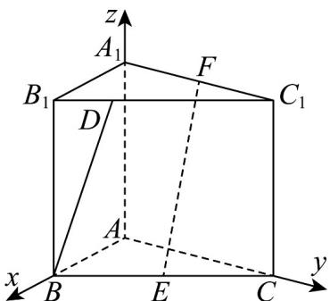
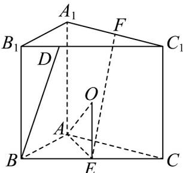

> [!faq]- 《高二数学上学期第三次月考（人教A版2019选择性必修第一册全部，高效培优·强化卷）》官方解析
>
> > [!success]- **【答案】** A. $EF // \text{平面 } AA_{1}B_{1}B$ B. 直线 $EF$ 与平面 $ABC$ 所成角的正弦值为 $\frac{2\sqrt{5}}{5}$ C. 直线 $BD$ 与直线 $EF$ 所成角最小时，线段 $BD$ 长为 $2\sqrt{3}$ D. 直三棱柱 $ABC - A_{1}B_{1}C_{1}$ 的外接球半径为 $2\sqrt{3}$
>
> > [!note]- **【解析】**
> > 在 $ABC - A_{1}B_{1}C_{1}$ 直三棱柱中， $AA_{1} \perp$ 平面 $ABC$ ，又 $AB, AC \subset$ 平面 $ABC$
> >
> > 则 $AA_{1} \perp AB, AA_{1} \perp AC$ ，又 $\angle BAC = 90^{\circ}$ ，因此 $AB, AC, AA_{1}$ 两两垂直，
> >
> > 以 A 为坐标原点， $AB, AC, AA_{1}$ 所在直线分别为 x, y, z 轴，建立空间直角坐标系，如图：
> >
> > 
> >
> > 对于 A，点 $E(2,2,0)$ ， $F(0,2,4)$ ， $EF=(-2,0,4)$ ，平面 $AA_{1}B_{1}B$ 的一个法向量为 $m=(0,1,0)$
> >
> > 则 $EF \cdot m = 0$ ，又 $EF \notin$ 平面 $AA_{1}B_{1}B$ ，因此 $EF //$ 平面 $AA_{1}B_{1}B$ ，A 正确；
> >
> > 对于 B，平面 ABC 的一个法向量为 $n = (0, 0, 1)$ ，设直线 EF 与平面 ABC 所成的角为 $\theta$ ，
> >
> > 则 $\sin\theta=|\cos\langle EF,n\rangle|=\frac{|\stackrel{\leftrightarrow}{EF}\cdot n|}{|EF||n|}=\frac{4}{2\sqrt{5}\times1}=\frac{2\sqrt{5}}{5}$ ，B正确；
> >
> > 对于 C，点 $B(4,0,0)$ , $B_{1}(4,0,4)$ , $C_{1}(0,4,4)$ ， $B_{1}C_{1}=(-4,4,0)$
> >
> > 由 $D$ 在线段 $B_{1}C_{1}$ 上，设 $\overline{B}_{1}D = \lambda \overline{B}_{1}C_{1} = (-4\lambda, 4\lambda, 0)$ ，其中 $\lambda \in [0,1]$ ，
> >
> > 则 $BD = BB_{1} + B_{1}D = (0,0,4) + (-4\lambda ,4\lambda ,0) = (-4\lambda ,4\lambda ,4)$
> >
> > 因此直线 $BD$ 与直线 $EF$ 所成的角的余弦值为 $\left|\cos \langle EF, BD\rangle \right| = \frac{\left|\overrightarrow{EF} \cdot \overrightarrow{BD}\right|}{\left|EF\right||BD|} = \frac{8(\lambda + 2)}{2\sqrt{5} \cdot \sqrt{16 + 32\lambda^2}}$
> >
> > $$
> > = \frac {\lambda + 2}{\sqrt {5} \sqrt {1 + 2 \lambda^ {2}}} = \frac {\sqrt {5}}{5} \cdot \sqrt {\frac {\lambda^ {2} + 4 \lambda + 4}{2 \lambda^ {2} + 1}}
> > $$
> >
> > 令函数 $f(\lambda)=\frac{\lambda^{2}+4\lambda+4}{2\lambda^{2}+1},\lambda\in[0,1]$ ，求导得 $f'(\lambda)=\frac{-2(\lambda+2)(4\lambda-1)}{(2\lambda^{2}+1)^{2}}$
> >
> > 当 $\lambda\in[0,\frac{1}{4})$ 时， $f'(\lambda)>0$ ，当 $\lambda\in(\frac{1}{4},1]$ 时， $f'(\lambda)<0$ ，
> >
> > 因此 $f(\lambda)$ 在 $\left[0, \frac{1}{4}\right]$ 上单调递增，在 $\left[\frac{1}{4}, 1\right]$ 上单调递减，则当 $\lambda = \frac{1}{4}$ 时， $f(\lambda)$ 取得最大值，
> >
> > 由余弦函数单调性得此时直线 $BD$ 与直线 $EF$ 所成的角最小，因此 $\frac{B_1D}{4} = \frac{1}{4}\frac{B_1C_1}{B_1D}, |\overline{B_1D}| = \sqrt{2}$
> >
> > 线段 BD 长为 $\sqrt{4^{2}+(\sqrt{2})^{2}}=3\sqrt{2}$ ，C 错误；
> >
> > 对于D，由 $AB = AC = 4$ ， $\angle BAC = 90^{\circ}$ ，得VABC为等腰直角三角形，
> >
> > VABC 外接圆圆心为 BC 的中点，外接圆半径为 $2\sqrt{2}$
> >
> > 因此直三棱柱 $ABC-A_{1}B_{1}C_{1}$ 的外接球球心即为 $CC_{1}B_{1}B$ 的中心 O，OE=2，
> >
> > 则外接球半径为 $\sqrt{AE^{2}+OE^{2}}=\sqrt{(2\sqrt{2})^{2}+2^{2}}=2\sqrt{3}$ ，D 正确.
> >
> > 
> >
> > 故选 **ABD**
