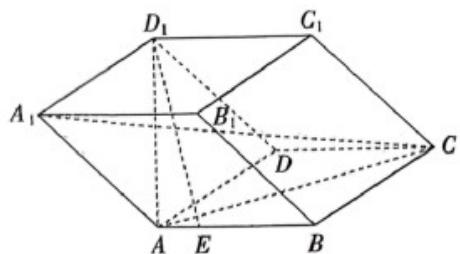

<!-- question-source:start -->
16．（15分）如图，四棱柱 $ABCD-A_{1}B_{1}C_{1}D_{1}$ 的所有棱长均为1，点 $E$ 满足 $\overline{AE}=\frac{1}{3}\overline{EB}$ ，设 $\overline{AB}=a,\overline{AD}=b,\overline{AA_{1}}=c$

(1)用 $a,b,c$ 表示 $\overline{A_1C},\overline{D_1E}$

(2)若 $AC = AD_{1} = \sqrt{2}, AC \cdot AD_{1} = \frac{1}{2}$ ，求 $\left|2a + c\right|$ 与 $D_{1}E$ 的值。
<!-- question-source:end -->

![[高中/课堂同步/题库/人教A版高中数学同步讲义(2026)/03_选择性必修第一册/月考/高二数学上学期第三次月考（人教A版2019选择性必修第一册全部，高效培优·强化卷）/四_解答题/questions/answers/Q00079072A1.md]]
