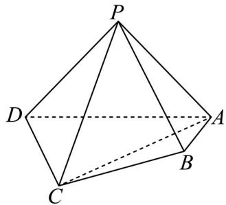

<!-- question-source:start -->
18. (17 分) 如图，在四棱锥 $P - ABCD$ 中， $\triangle PAD$ 是斜边为 $AD$ 的等腰直角三角形，

$$
A B \perp A D, A B = 1, A D = 4, A C = C D = C P = 2 \sqrt {2}
$$

(1)求证： $PD \perp$ 平面PAB；

(2)求异面直线 $PD, AC$ 所成的角；

(3)在棱 $PB$ 上是否存在点 $M$ ，使平面 $ADM$ 与平面 $ABCD$ 的夹角的余弦值为 $\frac{\sqrt{5}}{5}$ ？若存在，求出 $\frac{PM}{PB}$ 的值，

若不存在，请说明理由。
<!-- question-source:end -->

![[高中/课堂同步/题库/人教A版高中数学同步讲义(2026)/03_选择性必修第一册/月考/高二数学上学期第三次月考（人教A版2019选择性必修第一册全部，高效培优·强化卷）/四_解答题/questions/answers/Q00079074A1.md]]
