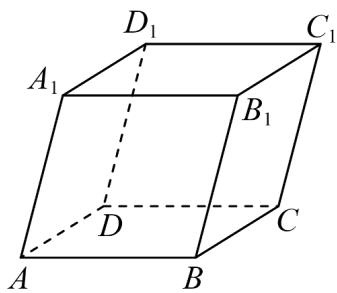

<!-- question-source:start -->
7．如图，在平行六面体 $ABCD-A_{1}B_{1}C_{1}D_{1}$ 中，设 $a=\overline{AA_{1}}$ ， $b=\overline{DB_{1}}$ ，若 a、b、c 组成空间向量的一个基底，

则 $c$ 可以是（ ）

A. $BB_{1}$ B. $BC_{1}$ C. BD D. $BD_{1}$
<!-- question-source:end -->

![[高中/课堂同步/题库/人教A版高中数学同步讲义(2026)/03_选择性必修第一册/期中专项训练+期中模拟卷/专项训练/专题02_空间向量基本定理_三大题型__高效培优期中专项训练_数学人教/_compact/answers/Q00062143A1.md]]
