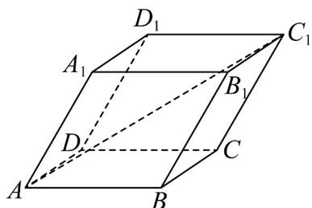

<!-- question-source:start -->
17．如图，在平行六面体 $ABCD - A_{1}B_{1}C_{1}D_{1}$ 中，已知 $AB = AD = AA_{1}$ ， $\angle A_{1}AB = \angle A_{1}AD = \angle BAD = 60^{\circ}$ ，则直线 $AC_{1}$ 与 $BB_{1}$ 所成角的余弦值为（）

A. $\frac{\sqrt{3}}{3}$ B. $\frac{\sqrt{3}}{2}$ C. $\frac{\sqrt{6}}{3}$ D. $\frac{\sqrt{6}}{2}$
<!-- question-source:end -->

![[高中/课堂同步/题库/人教A版高中数学同步讲义(2026)/03_选择性必修第一册/期中专项训练+期中模拟卷/专项训练/专题02_空间向量基本定理_三大题型__高效培优期中专项训练_数学人教/_compact/answers/Q00062152A1.md]]
