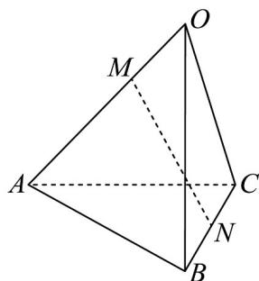

<!-- question-source:start -->
22. 如图，空间四边形 $OABC$ 中， $OA = a$ ， $OB = b$ ， $OC = c$ ，点 $M$ 在线段 $AO$ 上，且 $\left|MA\right| = 2\left|MO\right|$ ，点 $N$ 为 $BC$ 中点，则 $\overline{MN}$ 等于（）

A. $\frac{5}{3} a + \frac{3}{2} b + \frac{1}{2} c$ B. $\frac{1}{3} a + \frac{1}{2} b + \frac{1}{2} c$

C. $-\frac{2}{3} a + \frac{1}{2} b + \frac{1}{2} c$ D. $-\frac{1}{3} a + \frac{1}{2} b + \frac{1}{2} c$
<!-- question-source:end -->

![[高中/课堂同步/题库/人教A版高中数学同步讲义(2026)/03_选择性必修第一册/期中专项训练+期中模拟卷/专项训练/专题02_空间向量基本定理_三大题型__高效培优期中专项训练_数学人教/_compact/answers/Q00062157A1.md]]
