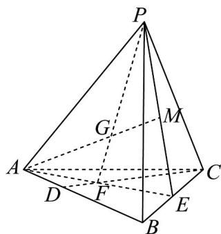

<!-- question-source:start -->
24. 如图，在三棱锥 $P - ABC$ 中， $AB = 2$ ， $AC = 2\sqrt{2}$ ，且三棱锥 $P - ABC$ 的体积 $V = \frac{4}{3}$ ， $D$ 是 $AB$ 上靠近点 $A$ 的三等分点， $E$ 是 $BC$ 中点，连接 $CD$ 、 $AE$ 交于点 $F$ ， $G$ 在线段 $PF$ 上，直线 $AG$ 交平面 $PBC$ 于点 $M$ ，且 $\frac{AG}{GM} = \frac{PG}{GF}$ .

(1)若 $AF = \lambda FE$ ，求 $\lambda$ 的值；

(2)求三棱锥 $P - FBM$ 的体积；

(3)若 $PA + PC = 4$ ，求此三棱锥 $P - ABC$ 的高.
<!-- question-source:end -->

![[高中/课堂同步/题库/人教A版高中数学同步讲义(2026)/03_选择性必修第一册/期中专项训练+期中模拟卷/专项训练/专题02_空间向量基本定理_三大题型__高效培优期中专项训练_数学人教/_compact/answers/Q00062159A1.md]]
