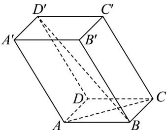

<!-- question-source:start -->
25. 如图所示，平行六面体 $ABCD - A'B'C'D'$ 的底面是边长为 2 的正方形，侧棱的长为 3， $\angle BAA' = \angle DAA' = 120^\circ$ ，则对角线 $BD'$ 的长是 \_\_\_\_。

<!-- question-source:end -->

![[高中/课堂同步/题库/人教A版高中数学同步讲义(2026)/03_选择性必修第一册/期中专项训练+期中模拟卷/专项训练/专题02_空间向量基本定理_三大题型__高效培优期中专项训练_数学人教/_compact/answers/Q00062160A1.md]]
