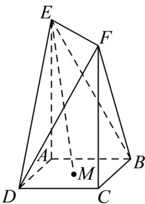

<!-- question-source:start -->
30. 如图，在多面体 $EF - ABCD$ 中，底面 $ABCD$ 是边长为 1 的正方形， $AE \perp$ 底面 $ABCD, CF \perp$ 底面 $ABCD$ ，且 $AE = CF, M$ 是正方形 $ABCD$ 的中心，若 $ME \cdot DF = \frac{7}{2}$ ，则 $AE = (\quad)$

A.2 B. $\frac{5}{2}$ C.5 D. $\frac{7}{2}$
<!-- question-source:end -->

![[高中/课堂同步/题库/人教A版高中数学同步讲义(2026)/03_选择性必修第一册/期中专项训练+期中模拟卷/专项训练/专题02_空间向量基本定理_三大题型__高效培优期中专项训练_数学人教/_compact/answers/Q00062164A1.md]]
