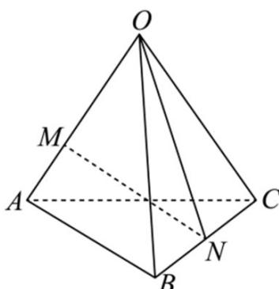

> [!faq]- 《专题02_空间向量基本定理_三大题型__高效培优期中专项训练_数学人教》官方解析
>
> > [!success]- **【答案】** D
>
> > [!note]- **【分析】**
> > 根据空间向量基本定理进行求解即可·
>
> > [!note]- **【解析】**
> > 因为 N 为 BC 的中点，则 $BN = NC$ ，所以，ON - OB = OC - ON，
> > 则 $ON = \frac{1}{2}OB + \frac{1}{2}OC$ ，因此， $MN = ON - OM = -\frac{2}{3}OA + \frac{1}{2}OB + \frac{1}{2}OC$
> >
> > 故选：D
> >
> > 
